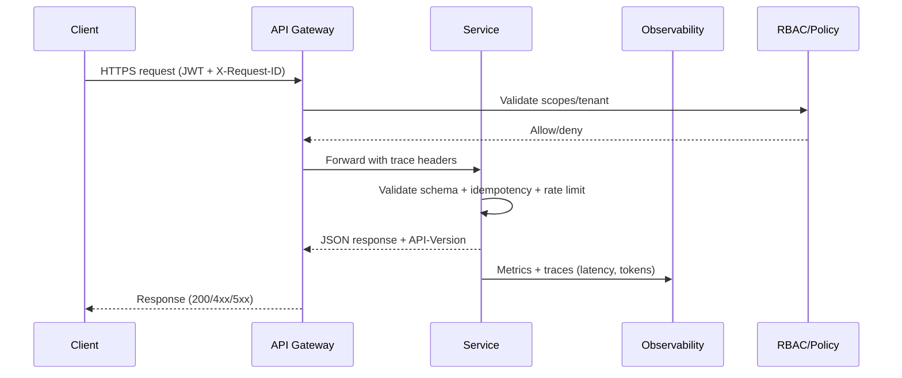

# API Specification — Multi‑Tenant, Multi‑User, Multi‑Domain

> Contract‑first standards for building reliable, secure, AI‑aware REST APIs and webhooks across all product domains.

## 1) Executive Summary

This document defines **how every service exposes and evolves APIs** across the platform. It aligns with the platform’s governance gates (linting, contract tests, deprecation policy), security controls (OAuth2/OIDC, TLS 1.3, RBAC), and observability/tracing requirements. It is **binding** for new endpoints and retrofits during maintenance.

**You must also read:** Versioning Policy, API Governance, Security Guidelines, Threat Model, and the OpenAPI schema for your service (linked in _references_).

---

## 2) Design Principles

1. **Contract‑first** — Design the OpenAPI contract before implementation. Keep it the single source of truth (SSOT).
2. **Backwards compatible by default** — Prefer additive changes. Breaking changes require a major version and a migration plan.
3. **Tenant & role isolation** — All data access is constrained by **tenant scope** and **RBAC** claims; no cross‑tenant leakage.
4. **Observable by design** — Every request is traceable end‑to‑end; costs and model metadata are recorded for AI endpoints.
5. **Security by default** — HTTPS/TLS 1.3 only, least‑privilege scopes, input validation, and rate limits are mandatory.

---

## 3) Versioning & Deprecation

- **URI major version** (required): `/api/v{MAJOR}/…` (e.g., `/api/v1/projects`).  
- **Header negotiation** (optional): clients may send `Accept-Version: 2.3.1`; servers return `API-Version` header.  
- **Lifecycle & deprecation**: Announce, run side‑by‑side, warn, and sunset over the standard timeline. Provide a migration guide and examples.

**Policy source of truth:** See the Versioning Policy for exact rules, support windows, and deprecation headers. 

---

## 4) Authentication, Authorization & Tenancy

### 4.1 Authentication
- **User flows**: OAuth 2.0 with PKCE (Authorization Code).  
- **M2M**: OAuth 2.0 Client Credentials for service‑to‑service.  
- **Tokens**: JWT access token (≈1h) + refresh token (≈30d).

### 4.2 Authorization
- **RBAC** with resource‑based checks at the gateway and service layer.
- Scopes MUST be explicit (e.g., `projects:read`, `projects:write`, `ai:run`).
- Prefer **row‑level security** (RLS) where applicable.

### 4.3 Multi‑Tenancy
- Every request MUST resolve to a tenant (from the JWT claim or `X-Tenant-Id` header). Services **must** enforce tenant scoping in queries and cache keys. RBAC and phase‑gates follow the platform’s user & access structure.

**Security standards reference** (authn, CORS allowlist, TLS 1.3+, CSP headers, API key legacy policy): Security Guidelines.

---

## 5) Observability, Tracing & AI Metadata

All endpoints MUST emit standard tracing headers and structured logs:

- **Correlation**: `X-Request-ID`, `X-Correlation-ID`, and B3 headers (`X-B3-TraceId`, `X-B3-SpanId`, `X-B3-Sampled`).  
- **Span attributes** (min set): `api.version`, `api.operation_id`, status code, latency ms, hashed user id, and for AI: `model.id`, `model.version`, `token_usage`.  
- **Dashboards & alerts**: latency p50/p99, error rate, availability, request rate, token usage for AI endpoints.

Distributed tracing and required metrics are defined in API Governance. AI responses must include metadata fields (e.g., `model_id`, `model_version`, `confidence`) per governance rules and Spectral checks.

---

## 6) Request/Response Conventions

### 6.1 JSON
- `Content-Type: application/json; charset=utf-8`
- Field names are **snake_case** in JSON; enums are **SCREAMING_SNAKE_CASE**.
- Timestamps use **UTC ISO‑8601**; money uses minor units with ISO‑4217 currency codes.

### 6.2 Idempotency
- For non‑safe write operations, support `Idempotency-Key` header; store key → response for at least 24h.

### 6.3 Pagination, Filtering, Sorting
- Prefer **cursor pagination**:  
  `GET /api/v1/components?cursor=eyJvZmZzZXQiOjEwMH0&limit=100` → returns `{ "items": […], "next_cursor": "…" }`  
- Filtering via exact field match or `field:operator` pattern (e.g., `status:in=APPROVED,PENDING`).  
- Sorting via `sort=created_at:desc,name:asc`.

### 6.4 Partial Responses & Expansion
- Support `fields=` to select sparse fields and `expand=` for related resources.

### 6.5 Errors (Structured)
- Use standard HTTP codes. Response body schema:

```json
{
  "error": "resource_not_found",
  "message": "Component CMP:XYZ was not found",
  "trace_id": "7d9d…",
  "details": {"missing_id": "CMP:XYZ"}
}
```

- Maintain a service‑local **Error Code Registry**; map to ADRs for major incidents. (See ADR template.)

---

## 7) Security Requirements

- HTTPS/TLS 1.3 only; strong ciphers; HSTS on public origins.
- OAuth2/OIDC as above; **no** session cookies for APIs.
- **Input validation** (schema‑based); reject unknown fields in write requests.
- **Rate limiting** (per IP and per identity): _reads_ ≈100–200 rpm; _writes_ ≈20–50 rpm (tune per service & SLOs).
- **Secrets** in a vault; rotate keys; avoid logging secrets/PII.
- **CORS** explicit allow‑list; **CSP** for browser origins.
- **Webhooks**: HMAC‑SHA256 signatures, idempotent retries with exponential backoff.

Threat categories and mitigations (spoofing, tampering, information disclosure, DoS, EoP) are detailed in the platform Threat Model; consult it during design reviews.

---

## 8) Governance Gates & Quality Bars

- **OpenAPI linting** with Spectral rules (semantic version in `info.version`, kebab‑case `operationId`, response examples present, and **AI metadata required** for ML endpoints). Failing rules **block** deploy.
- **Consumer‑driven contracts** (Pact): publish, verify, and run `can-i-deploy` before release.
- **Client drift prevention**: generate typed SDKs from OpenAPI in CI/CD for web/mobile; verify coverage.
- **Versioning & deprecation**: follow SemVer and staged sunset with notices and migration guides.

---

## 9) Webhooks

### 9.1 Events
Publish domain events using stable names and schemas. Examples:  
`payment.succeeded`, `payment.failed`, `refund.succeeded`, `dispute.opened`, `escrow.opened`, `escrow.released`.

### 9.2 Delivery
- **Security**: `X-Signature: sha256=…` over the raw body; include timestamp and idempotency token.  
- **Retries**: exponential backoff for ≥24h; stop on 2xx.  
- **At‑least‑once** delivery; recipients must be idempotent.

---

## 10) AI/ML Endpoint Guidance

- **Deterministic I/O**: define JSON schemas for inputs/outputs; include `model_id`, `model_version`, `confidence`, and `evidence` links when applicable.  
- **Cost & token tracking**: log token usage and latency; expose on metrics endpoints.  
- **Guardrails**: validate outputs against schema; route high‑risk requests via a policy router; attach trace IDs for audits.

See API Governance for required metadata and tracing; see Model Card and Eval Plan for model transparency and evaluation linkage.

---

## 11) Examples

### 11.1 Standard collection read

```http
GET /api/v1/components?cursor=…&limit=50 HTTP/1.1
Authorization: Bearer eyJ…
X-Request-ID: 7d9d…
```

```json
{ "items": [{"id":"CMP:…"}], "next_cursor": "eyJvZmZzZXQiOjUwMH0" }
```

### 11.2 Create with idempotency

```http
POST /api/v1/projects HTTP/1.1
Authorization: Bearer eyJ…
Content-Type: application/json
Idempotency-Key: 0a6d6c5e-…

{ "name": "Site A – BESS Retrofit", "tenant_id": "TENANT_123" }
```

### 11.3 Webhook delivery

```http
POST /webhooks/payment HTTP/1.1
X-Signature: sha256=8d0f…
Content-Type: application/json

{ "id":"evt_123", "type":"payment.succeeded", "data":{"amount_minor":129900,"currency":"USD"} }
```

---

## 12) OpenAPI Requirements

- `openapi: 3.1.x`, complete component schemas, **examples on all responses**, named error schemas.  
- `info.version` uses **SemVer** and tracks the deployed artifact version.  
- `operationId` is **kebab-case** (e.g., `list-components`, `create-project`).  
- Tag endpoints by domain; include server URLs per environment.  
- Lint with repo `.spectral.yml` and fix all errors/warnings before merge.

---

## 13) Release Checklist

- [ ] OpenAPI updated; Spectral lint passes (0 errors)  
- [ ] Pact contracts published & verified; `can-i-deploy` passes  
- [ ] SDK regenerated and integration tests green  
- [ ] Deprecation notices (if any) added to docs and headers  
- [ ] Dashboards & alerts updated; runbook entries reviewed  
- [ ] Security review: auth scopes, input validation, rate limits, webhook signing  
- [ ] ADR created for breaking changes/major decisions

---

## 14) Reference Diagrams



---

## 15) Appendix

- **Enums & codes**: Maintain a central error code list and event names registry.  
- **Testing matrix**: Unit, integration, contract, load, security, chaos. See governance docs for cadence and thresholds.
