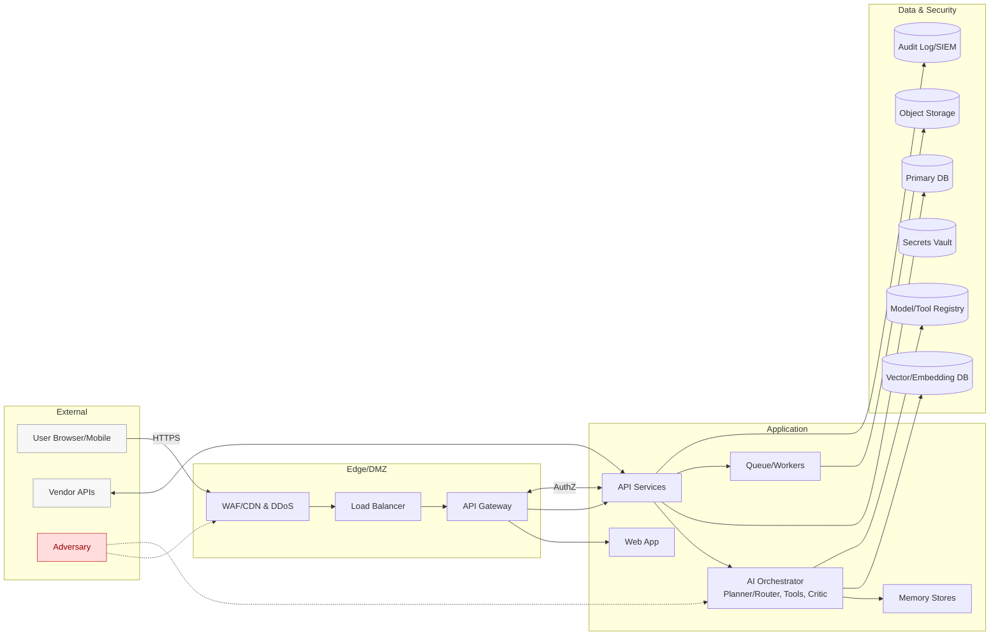

---
owner: security-and-privacy
last_review: 2025-09-21
status: template
tags: ["gdpr", "dpia", "privacy-by-design", "multi-tenant", "ai-agentic", "llm"]
references:
  - "../08-security/Threat-Model.md"
  - "../08-security/Security-Guidelines.md"
  - "../09-governance/API-Governance.md"
  - "../09-governance/Versioning-Policy.md"
  - "../06-ml-ai/Model-Card.md"
  - "../06-ml-ai/Tool-Specs.md"
  - "../06-ml-ai/Eval-Plan.md"
  - "../05-dev/Coding-Standards.md"
  - "../07-ops/Observability-Runbook.md"
  - "../07-ops/SLOs.md"
  - "../04-data/Data-Governance.md"
---

# Data Privacy Impact Assessment (DPIA) — Multi‑Tenant AI Agentic Platform

> **Purpose.** Assess and mitigate privacy risks for a multi‑tenant, multi‑user, multi‑domain platform that uses AI agents (LLMs + tools) to process personal and business data across design, procurement, operations, support and commerce features.

---

## 0) Executive Summary

- **System**: Event‑driven AI platform with orchestrator (planner/router, tool‑calling, critic/verifier), memory (episodic/semantic), Graph‑RAG grounding, and typed/permissioned tool registry.
- **Scope**: End‑to‑end processing—account & identity, chat/prompts, uploaded media/docs, telemetry & evaluations, audit trails, marketplace/commerce events.
- **Tenancy model**: Hard multi‑tenancy with org‑level isolation, role‑based access control (RBAC), phase gates, and least‑privilege scopes.
- **Key risks**: Over‑collection, cross‑tenant data leaks, prompt‑injection, data poisoning, model extraction/inversion, unlawful secondary use, transfer risks.
- **Controls**: Data minimisation (schema‑bound inputs, scoped memory, PII redaction), region routing & residency, encryption in transit/at rest, signed/audited changes, rate limits, drift detection, governance gates, DSAR automation.
- **Outcome**: With listed mitigations and operating procedures, residual risk is **Low/Medium**. Proceed with launch, subject to sign‑off and periodic reviews.

---

## 1) System Description & Context

### 1.1 Business objectives
- Enable AI‑assisted design, procurement, operations, support and commercial workflows while preserving data subject rights and contractual confidentiality.
- Provide transparent **Planner Trace** (Intent → Plan → Actions/Evidence → Proposed changes → Approvals) and reversible actions via JSON‑Patch.- Support enterprise features: auditability, SIEM hooks, RBAC gates, regional data residency, and model/tool versioning.

### 1.2 Parties & roles
- **Controller(s)**: Your company (and tenant organisations where acting as controllers of their own users’ data).
- **Processor(s)/Sub‑processors**: Cloud providers, model providers, observability vendors, email/SMS gateways (listed in the Vendor Register; attach DPAs).
- **Data subjects**: End‑users, employees, suppliers, customers, prospects.

### 1.3 Processing contexts (high‑level)
- Authentication & account management; chat and co‑pilot usage; file uploads & parsing; AI tool executions; evaluations & monitoring; incident handling; billing & marketplace transactions.

---

## 2) Inventory of Processing Activities (ROPA extract)

> Complete the table per product surface. Add one row per discrete purpose and legal basis.

| ID | Processing Activity | Purpose | Data Categories | Data Subjects | Lawful Basis | Retention | Recipients/Transfers |
|----|---------------------|---------|-----------------|---------------|--------------|-----------|----------------------|
| P‑01 | Account & Identity | Access control, authentication | Name, email, org, roles, last login, MFA factors | Users | Contract | Active + 24 mo logs | Cloud auth, SIEM |
| P‑02 | Chat/Prompts & Memory | Provide AI assistance | Prompts, system context, tool outputs, traces | Users | Legit. interest/Contract | 12 mo default (configurable) | LLM provider (regional), observability |
| P‑03 | File Uploads & Parsing | Turn docs/media into structured data | PDFs, images, metadata, hashes | Users/Suppliers | Contract | 24 mo (or per tenant policy) | Storage, parsing workers |
| P‑04 | Evaluations & Telemetry | Quality/cost/latency monitoring | Metrics, model IDs, latency, token counts | Users (pseudonymous) | Legit. interest | 12 mo rolling | Observability |
| P‑05 | Marketplace/Payments | Orders, payouts, escrow | Names, addresses, payouts, invoices | Customers/Suppliers | Contract/Legal obligation | 7–10 yrs (tax/audit) | PSP, escrow partner |
| P‑06 | Incidents & Security | Detect/respond to threats | IPs, device, headers, events, audit logs | Users/Attackers | Legit. interest/Legal obligation | 12–24 mo | Security stack |
| … | … | … | … | … | … | … | … |

> **Note:** Classify each field per Data Governance policy; avoid free‑text PII in long‑term memory; prefer structured, schema‑validated inputs.

---

## 3) Data Minimisation & Memory Policy

- **Contract‑first I/O**: Enforce strict JSON Schemas for all tool calls and model outputs; reject extra fields. Use “deterministic tools > free text” where possible.
- **Scoped memory**: Externalise conversation state; use token‑aware windows and progressive summarisation to avoid retaining raw PII where not needed. Summaries must remove identifiers unless strictly required for service continuity.
- **PII guards**: Run PII detectors on uploads and memory writes; redact/unlink sensitive attributes unless a valid purpose exists (e.g., invoicing).
- **Context minimalism**: Pass only the fields necessary for a task to the model/tool invocation; never forward entire project history by default.
- **Caching**: Cache prompts/embeddings/tool outputs with TTLs and event‑driven invalidation; mark cache keys with model/tool version and tenant.

---

## 4) Data Flow, Trust Boundaries & Residual Risks

- Edge controls: WAF/DDoS, rate limits, schema validation, strict auth.
- Application controls: RBAC, phase gates, read‑only views after publish, JSON‑Patch with approver signatures.
- Data controls: encryption at rest/in transit, regional stores, key management, audit immutability, versioned model/tool artifacts.
- AI‑specific controls: prompt‑injection filters, output validation, response schema enforcement, drift detection, model extraction/bulk‑download protections.

---

## 5) Lawful Basis & Special Categories

- **Contract** (Art. 6(1)(b)): Provide the core service (design, collaboration, procurement, support).
- **Legitimate interests** (Art. 6(1)(f)): Security monitoring, quality/evaluation telemetry, product improvement—apply documented LIA and allow opt‑out where feasible.
- **Legal obligation** (Art. 6(1)(c)): Tax/audit retention for invoices and payouts.
- **Consent** (Art. 6(1)(a)): Optional features (marketing emails, public template sharing). Capture granular, revocable consent in UI.
- **Special categories**: Not expected. If present (e.g., images containing health/safety incidents), treat as **restricted**, apply minimisation/redaction, and document purpose & safeguards.
- **Children’s data**: Not intentionally processed; implement age‑gating where required.

---

## 6) Data Subject Rights (DSRs)

- **Access/Portability**: Export per‑tenant JSON bundles (project docs, prompts, model versions, audit).
- **Rectification/Objection**: Allow edits to account/profile; configurable retention & telemetry opt‑out.
- **Erasure**: Hard‑delete account data and soft‑delete audit with tombstones (where law allows); purge caches and embeddings; document exceptions (e.g., invoices).
- **Right‑to‑Switch**: Enable changing managing companies without losing project history; maintain warranty ledger and design provenance.- **DSAR SLA**: Acknowledge within 24–72h; fulfil within 30 days; provide contact & escalation path.

---

## 7) International Transfers & Residency

- **Region routing**: Route prompts, storage, and logs to selected regions (e.g., EU/US/APAC). Avoid cross‑region memory by default.
- **Sub‑processor due diligence**: Maintain list of processors with DPAs, SCCs/UK IDTA; run TIAs for high‑risk transfers; vendor access least‑privileged & audited.
- **Edge cases**: Temporary failover may cross regions; capture events and notify tenants if residency guarantees are breached; provide remediation.

---

## 8) Security Controls (summary)

- **Identity & Access**: SSO/MFA, short‑lived JWTs with scopes; service‑to‑service auth; per‑tenant org IDs in every query.
- **AppSec**: Input validation, prepared statements, RLS, output encoding, secure headers; dependency & container scanning.
- **AI‑specific**: Tool allow‑lists; schema‑validated tool I/O; rate limits per user & model; watermarking/extraction throttles; model signing & registry.
- **Ops**: Centralised logging with immutability; error budgets & SLOs; incident runbooks; red‑team prompts & jailbreak suites.
- **Media Privacy**: Client‑side face/license‑plate blur options; server‑side redaction pipelines; metadata scrubbing for shared media.
- **Monitoring**: Traces for every LLM/tool call (latency, cost, cache hit/miss); drift/anomaly alerts; audit log integrity checks.

---

## 9) Retention & Deletion

> Fill actual numbers per policy. Defaults below are conservative starting points.

| Data Class | Default Retention | Notes |
|-----------|-------------------|-------|
| Accounts & Roles | Life of contract + 24 months | Anonymise on request |
| Chat Prompts & Memory | 12 months (tenant‑configurable) | Summarise >N days; redact identifiers |
| Uploads (docs/images) | 24 months (tenant‑configurable) | Hash & provenance retained longer |
| Telemetry & Evaluations | 12 months | Pseudonymous; roll‑ups beyond |
| Commerce (invoices/payouts) | 7–10 years | Legal/audit requirements |
| Audit/Security Logs | 12–24 months | Immutable storage; signed |

Deletion must cascade to caches, embeddings, derived stores and backups (subject to backup windows). Maintain **deletion manifests** for audit.

---

## 10) Risk Assessment (STRIDE + AI attack surface)

> Calibrate likelihood/impact on 1–3 or 1–5 scale. List owner & mitigations, link to Incident Playbooks.

| Threat | Example Risk | Likelihood | Impact | Residual | Mitigations |
|---|---|---:|---:|---:|---|
| Prompt Injection | Model coerced to exfiltrate secrets | Med | High | Med | Prompt filters, tool sandbox, output validators, allow‑list tools |
| Model Extraction | Adversary clones model via queries | Med | High | Med | Rate limits, watermarking, anomaly detection, legal terms |
| Data Poisoning | Malicious uploads change behaviour | Low | High | Low/Med | Provenance, moderated ingestion, quarantine queues |
| Cross‑Tenant Leak | Mis‑scoped query or cache key | Low | Critical | Low | Tenant scoping everywhere, row‑level security, cache key namespacing |
| Over‑collection | Memory stores raw PII | Med | Med | Low | Schema‑bound context, summarisation, TTLs, redaction |
| Transfer Risk | Data leaves selected region | Low | High | Low/Med | Region routing, vendor DPAs/SCCs, failover notices |

> Link out to detailed Threat Model & AI attack surface and keep this table in sync with security reviews.

---

## 11) DPIA Outcomes & Actions

- **Design changes required**: e.g., expand redaction to tool outputs; enforce schema on all tool calls; add region pinning for embeddings.
- **Procedural changes**: quarterly privacy training; incident tabletop for jailbreaks; add DSAR automation in admin.
- **Next reviews**: Quarterly, or after major architectural changes, new vendors, or scope expansions.
- **Residual risk**: _Low/Medium_ after mitigations.

### Sign‑off

- **DPO/Privacy**: _Name, Title, Date_
- **Security**: _Name, Title, Date_
- **Product/Engineering**: _Name, Title, Date_
- **Legal**: _Name, Title, Date_

---

## 12) Appendices

- **A. Records of Processing Activities (full)** — attach/export from register.
- **B. Legitimate Interests Assessments (LIAs)** — for telemetry, product improvement.
- **C. Transfer Impact Assessments (TIAs)** — for cross‑border vendors.
- **D. Vendor Register & DPAs** — list all processors/sub‑processors.
- **E. Data Classification & RBAC Matrix** — per tenant roles & scopes.
- **F. DSAR Handling SOP** — step‑by‑step guide, SLAs, macros.
- **G. Change Log & Versioning** — link to ADRs and policy versions.

> **Authoring notes:** Keep this DPIA in lockstep with Threat Model, Security Guidelines, Versioning Policy, API Governance, Model Cards, Tool Specs, Eval Plan, Observability, SLOs, and Data Governance. Update after any material change to architecture, vendors, or processing purposes.
