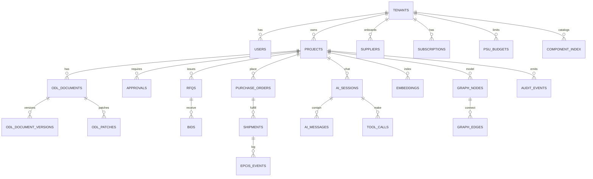

# Database Design (Multi‑Tenant, Multi‑User, Multi‑Domain)

> **Purpose.** Define the canonical data architecture for AI‑agentic platforms built on ODL‑SD, covering transactional storage, the JSON document store, AI memory/embeddings, event logs, observability, and governance. All docs in this repo must include YAML front‑matter and follow our living‑docs standards. fileciteturn0file20

---

## 1) Executive Summary

- **Primary store:** **PostgreSQL 15+** with **JSONB** for ODL‑SD documents, relational tables for cross‑cutting concerns (auth, RBAC, procurement, logistics), and **pgvector** for embeddings. Governance relies on append‑only audit and JSON‑Patch histories. This aligns with the ODL‑SD 4.1 schema, lifecycle, and validation rules. fileciteturn0file33  
- **Multi‑tenancy & RBAC:** Every row carries `tenant_id` (ULID) with **Row‑Level Security (RLS)** enforcing least‑privilege and **phase gates**. Role codes are **R/W/P/A/X/S** with scope inheritance down the project hierarchy (Portfolio→Site→…→Device). fileciteturn0file31  
- **AI layers:** Episodic/semantic memory, **CAG** (cache‑ahead‑of‑generation) store, Graph‑RAG projections, and tool‑call traces are first‑class. Regional routing and data residency are supported by per‑region clusters and **RegionRouter** metadata. fileciteturn0file29  
- **Component & procurement:** Component Management (status machine, suppliers, RFQ→Bids→PO→Shipments→Inventory→Warranty) is modeled with JSONB + relational indexes for fast lookups and reporting. fileciteturn0file32  
- **Monetisation:** Plans, subscriptions, PSUs, marketplace transactions, escrow triggers, and audit retention are captured to meet the commercial canon. fileciteturn0file30  
- **Performance & reliability:** Avoid N+1 queries, add Redis read‑caching, use eager‑loading, and instrument latencies/tokens/costs. fileciteturn0file28 fileciteturn0file37  

---

## 2) Storage Strategy

### 2.1 ODL‑SD Document Store (source of truth)

- Each **Project** owns a **current ODL‑SD document** (JSONB) + **immutable versions** and **JSON‑Patch deltas**. Validate against JSON Schema **2020‑12**, maintain content hashes, and support external references for large sub‑trees (object storage) with LRU caching. fileciteturn0file33  
- Use **atomic apply** of up to 100 ops/patch with optimistic concurrency (`doc_version`), inverse‑patch generation for rollback, and evidence URIs. fileciteturn0file29  

**Tables (core):**

```sql
-- Tenants & Users
create table tenants (
  tenant_id       text primary key,     -- ULID
  name            text not null,
  region          text not null check (region in ('US','EU','APAC')),
  created_at      timestamptz not null default now()
);

create table users (
  user_id         text primary key,     -- ULID
  tenant_id       text not null references tenants(tenant_id),
  email           text unique not null,
  role            text not null,        -- coarse app role; fine-grained via rbac tables
  mfa_enabled     boolean not null default true,
  created_at      timestamptz not null default now()
);

-- Projects & ODL documents
create table projects (
  project_id      text primary key,     -- ULID
  tenant_id       text not null references tenants(tenant_id),
  name            text not null,
  phase           text not null,        -- design/procurement/...
  classification  text not null,        -- public|internal|confidential|restricted
  created_at      timestamptz not null default now()
);

create table odl_documents (
  doc_id          text primary key,     -- ULID
  project_id      text not null references projects(project_id) on delete cascade,
  schema_version  text not null,        -- e.g., 4.1
  doc_json        jsonb not null,
  doc_hash        text not null,        -- sha256
  valid_from      timestamptz not null default now(),
  created_by      text not null references users(user_id)
);

create index idx_odl_documents_gin on odl_documents
  using gin (doc_json jsonb_path_ops);
```

> The top‑level shape, section keys, and data management options (partitioning, external refs, streaming) come directly from **ODL‑SD v4.1**. fileciteturn0file33

**Versioning & Patches:**

```sql
create table odl_document_versions (
  version_id      bigserial primary key,
  doc_id          text not null references odl_documents(doc_id) on delete cascade,
  version         int not null,
  doc_hash        text not null,
  doc_json        jsonb not null,
  created_at      timestamptz not null default now(),
  created_by      text not null references users(user_id)
);

create table odl_patches (
  patch_id        bigserial primary key,
  doc_id          text not null references odl_documents(doc_id) on delete cascade,
  from_version    int not null,
  to_version      int not null,
  patch_json      jsonb not null,   -- RFC 6902
  inverse_patch   jsonb not null,
  evidence_uris   jsonb not null default '[]'::jsonb,
  intent          text,
  tool_version    text,
  dry_run         boolean not null default false,
  created_at      timestamptz not null default now(),
  created_by      text not null references users(user_id)
);
```

### 2.2 RBAC, Phase Gates & Approvals

- Implement **scope inheritance** and the **R/W/P/A/X/S** right codes; approvals required for merges to sensitive sections (libraries, compliance, finance). fileciteturn0file31  

```sql
create table rbac_roles (
  role_id    text primary key,   -- e.g., engineer, project_manager, expert
  notes      text
);

create table rbac_assignments (
  user_id    text not null references users(user_id),
  project_id text not null references projects(project_id),
  role_id    text not null references rbac_roles(role_id),
  primary key (user_id, project_id)
);

create table approvals (
  approval_id   bigserial primary key,
  project_id    text not null references projects(project_id),
  section       text not null,     -- e.g., 'libraries','compliance','finance'
  outcome       text not null check (outcome in ('approved','rejected','waived')),
  approver_role text not null,
  comment       text,
  created_at    timestamptz not null default now()
);
```

**Row‑Level Security (RLS) sketch:**

```sql
alter table projects enable row level security;
create policy project_tenant_isolation on projects
  using (tenant_id = current_setting('app.tenant_id')::text);

alter table odl_documents enable row level security;
create policy odl_docs_tenant_isolation on odl_documents
  using (exists (
    select 1 from projects p
    where p.project_id = odl_documents.project_id
      and p.tenant_id = current_setting('app.tenant_id')::text
  ));
```

> Phase‑gate rules and approver matrices come from the **ODL‑SD User & Access Structure**. Mirror them in API guards and DB policies. fileciteturn0file31

### 2.3 Component Management, Procurement & Logistics

Model high‑change domains using JSONB projections + relational indices for reporting. Status enums, supplier links, RFQs/Bids/POs, shipments, inventory, warranties and returns follow the Component Management supplement. fileciteturn0file32

```sql
-- Fast lookup over component_identity + status
create table component_index (
  component_id     text primary key,
  tenant_id        text not null references tenants(tenant_id),
  brand            text not null,
  part_number      text not null,
  rating_w         integer not null,
  status           text not null,      -- e.g., parsed, approved, rfq_open, shipped, installed, ...
  classification   jsonb,              -- unspsc/eclass/hs_code/gtin
  extra            jsonb not null default '{{}}'::jsonb,
  updated_at       timestamptz not null default now()
);
create index idx_component_status on component_index(status);
create index idx_component_brand_part on component_index(brand, part_number);

-- Suppliers, RFQs, Bids, POs (subset)
create table suppliers (
  supplier_id   text primary key,
  tenant_id     text not null references tenants(tenant_id),
  name          text not null,
  status        text not null check (status in ('draft','approved','inactive')),
  gln           text
);

create table rfqs (
  rfq_id        text primary key,
  tenant_id     text not null references tenants(tenant_id),
  project_id    text not null references projects(project_id),
  spec_json     jsonb not null,
  status        text not null check (status in ('draft','issued','bidding','evaluating','awarded')),
  created_at    timestamptz not null default now()
);

create table bids (
  bid_id        text primary key,
  rfq_id        text not null references rfqs(rfq_id) on delete cascade,
  supplier_id   text not null references suppliers(supplier_id),
  price_amount  numeric not null,
  currency      text not null,
  incoterms     text,
  lead_time_days integer,
  status        text not null check (status in ('pending','won','lost')),
  submitted_at  timestamptz not null default now()
);

create table purchase_orders (
  po_id         text primary key,
  tenant_id     text not null references tenants(tenant_id),
  project_id    text not null references projects(project_id),
  supplier_id   text not null references suppliers(supplier_id),
  items_json    jsonb not null,
  total_amount  numeric not null,
  currency      text not null,
  status        text not null check (status in ('draft','issued','shipped','delivered','closed','cancelled')),
  created_at    timestamptz not null default now()
);

-- EPCIS-style logistics & inventory
create table shipments (
  shipment_id    text primary key,
  po_id          text not null references purchase_orders(po_id),
  status         text not null,
  tracking_ref   text,
  eta            timestamptz,
  meta           jsonb not null default '{{}}'::jsonb
);

create table epcis_events (
  event_id       bigserial primary key,
  shipment_id    text not null references shipments(shipment_id) on delete cascade,
  event_time     timestamptz not null,
  event_type     text not null,  -- pickup, departed, arrived, delivered, delivery_exception
  location       text,
  evidence_uri   text
);
```

> The end‑to‑end flow (RFQ→Bids→PO→Shipments→Inventory→Warranty) and traceability are specified in the CMS supplement. fileciteturn0file32

### 2.4 Monetisation (Plans, Subscriptions, PSUs, Escrow)

- Encode plan catalog, org subscriptions, PSU budgets, marketplace fees, escrow milestones tied to governance events. fileciteturn0file30

```sql
create table plans (
  plan_code    text primary key,  -- FREE|PRO|ENTERPRISE
  price_month  integer,           -- minor units
  price_year   integer,
  features     jsonb not null default '[]'::jsonb
);

create table subscriptions (
  subscription_id text primary key,
  tenant_id       text not null references tenants(tenant_id),
  plan_code       text not null references plans(plan_code),
  seats           integer not null default 1,
  status          text not null,
  billing_cycle   text not null,  -- monthly|annual
  started_at      timestamptz not null default now(),
  ends_at         timestamptz
);

create table psu_budgets (
  tenant_id     text not null references tenants(tenant_id),
  user_id       text references users(user_id),
  monthly_psu   integer not null,
  consumed_psu  integer not null default 0,
  period_start  date not null,
  primary key (tenant_id, user_id, period_start)
);
```

---

## 3) AI Data Surfaces

### 3.1 Memory, CAG & Tool Traces

- **Memory:** Keep active session history in Redis; persist summaries and long‑term threads in Postgres with token‑aware pruning & progressive summarisation. fileciteturn0file25  
- **CAG store:** Cache prompts/embeddings/tool outputs with event‑driven invalidation & drift checks. fileciteturn0file29  

```sql
create table ai_sessions (
  session_id     text primary key,
  tenant_id      text not null references tenants(tenant_id),
  user_id        text not null references users(user_id),
  created_at     timestamptz not null default now()
);

create table ai_messages (
  id             bigserial primary key,
  session_id     text not null references ai_sessions(session_id) on delete cascade,
  role           text not null,  -- system|user|assistant|tool
  content        text not null,
  token_count    int,
  created_at     timestamptz not null default now()
);

create table cag_entries (
  key            text primary key,  -- stable hash of (prompt|inputs|tool)
  tenant_id      text not null references tenants(tenant_id),
  value_json     jsonb not null,
  expires_at     timestamptz,
  created_at     timestamptz not null default now()
);

create table tool_calls (
  id             bigserial primary key,
  session_id     text references ai_sessions(session_id),
  tool_name      text not null,
  input_json     jsonb not null,
  output_json    jsonb,
  latency_ms     int,
  tokens_prompt  int,
  tokens_output  int,
  cost_usd       numeric,
  created_at     timestamptz not null default now()
);
```

### 3.2 Embeddings & Graph‑RAG

- Use **pgvector** for semantic search over project shards; store per‑chunk embeddings referencing document pointers. Project a Graph‑RAG of the ODL‑SD (nodes/edges) for grounding. fileciteturn0file29 fileciteturn0file33

```sql
-- Requires: CREATE EXTENSION IF NOT EXISTS vector;
create table embeddings (
  embedding_id  bigserial primary key,
  tenant_id     text not null references tenants(tenant_id),
  project_id    text not null references projects(project_id),
  doc_id        text not null references odl_documents(doc_id),
  json_pointer  text not null,            -- where this chunk lives in the doc
  text_chunk    text not null,
  embedding     vector(1536) not null,    -- example dimension
  created_at    timestamptz not null default now()
);
create index on embeddings using ivfflat (embedding vector_cosine_ops);

create table graph_nodes (
  node_id     text primary key,
  tenant_id   text not null references tenants(tenant_id),
  project_id  text not null references projects(project_id),
  type        text not null,   -- inverter, string, surface, etc.
  attrs       jsonb not null default '{{}}'::jsonb
);
create table graph_edges (
  edge_id     bigserial primary key,
  tenant_id   text not null references tenants(tenant_id),
  project_id  text not null references projects(project_id),
  from_node   text not null references graph_nodes(node_id),
  to_node     text not null references graph_nodes(node_id),
  kind        text not null,   -- electrical, physical, data, control
  attrs       jsonb not null default '{{}}'::jsonb
);
```

---

## 4) Performance, Indexing & Partitioning

- **GIN** over JSONB paths for hot fields; **partial indexes** for statuses; **covering indexes** for RFQ/Bid lists; **pgvector** for semantic lookups. Avoid **N+1** by eager‑loading/joins and add Redis caching for read‑heavy endpoints. fileciteturn0file28 fileciteturn0file37  
- **Partitioning:** list‑partition by `tenant_id` for multi‑tenant isolation; range‑partition high‑volume logs by `created_at` (monthly). Large sections may use **external references** and streaming. fileciteturn0file33

```sql
-- Example: range partitions for epcis_events
create table epcis_events_y2025m09 partition of epcis_events
  for values from ('2025-09-01') to ('2025-10-01');
```

---

## 5) Security, Residency & Compliance

- **RLS everywhere** with `tenant_id`; encrypt data at rest; hash/sign audit logs; SIEM webhooks. **RegionRouter** dictates cluster/region for tenants, aligned to DPIA and residency. fileciteturn0file29  
- **Data classification** fields (`public|internal|confidential|restricted`) flow from the ODL‑SD and RBAC policy; approvals are required for sensitive sections. fileciteturn0file31  
- **JSON Schema validation** at write time; store model/version/hash; cache validation results for performance. fileciteturn0file33

---

## 6) Observability, Auditing & Cost

- Trace **latency, tokens, cost** for every tool/API call; maintain append‑only **audit** with signatures; publish metrics to dashboards and alerts. See engineering standards (performance, caching, rate limiting). fileciteturn0file28 fileciteturn0file37  
- Keep **AI cost accounting** per tenant/user tied to PSU budgets. fileciteturn0file30

```sql
create table audit_events (
  event_id    bigserial primary key,
  tenant_id   text not null references tenants(tenant_id),
  project_id  text references projects(project_id),
  doc_id      text references odl_documents(doc_id),
  actor_id    text not null references users(user_id),
  action      text not null,  -- patch_applied|approval|login|tool_call|po_issued...
  payload     jsonb not null,
  signature   text,           -- optional cryptographic signature
  created_at  timestamptz not null default now()
);
```

---

## 7) Migrations & Tooling

- Use **Alembic** (Python) and code‑generated models in the monorepo; API is FastAPI with Postgres + Redis. Include seed/golden docs for tests. fileciteturn0file35  
- Generate TS types and Pydantic models **from the JSON Schemas** (SSOT). **Do not duplicate enums**; avoid hardcoded status lists in UI. fileciteturn0file37

---

## 8) ER Overview



---

## 9) Validation & Sample Queries

```sql
-- Validate schema on write (pseudo)
-- SELECT json_schema_validates(:doc_json, 'https://odl-sd.org/schemas/v4.1/document.json');

-- Example: list "approved" components for a tenant
select component_id, brand, part_number, rating_w
from component_index
where tenant_id = :tenant and status = 'approved'
order by brand, part_number;

-- Example: nearest-neighbour search over embeddings (pgvector)
-- select * from embeddings order by embedding <-> :qvec limit 10;
```

---

## 10) Checklists

**Go‑Live Checklist**  
- [ ] RLS enabled on all tenant‑scoped tables (spot audit)  
- [ ] JSON Schema validation wired for ODL‑SD writes (unit + integration tests)  
- [ ] Partitioning in place for `audit_events`, `epcis_events`, `tool_calls`  
- [ ] pgvector installed and indexed; backfill initial embeddings  
- [ ] PSU accounting and alerts configured  
- [ ] CDC/backup with PITR validated in a restore drill

**Performance Checklist**  
- [ ] Slow queries analysed; GIN/covering indexes added  
- [ ] Eager‑loading for ORM paths at risk of N+1  
- [ ] Redis cache hit‑rate ≥ 85% for hot reads fileciteturn0file28

---

### References (source highlights)

- Living‑docs standards & cross‑linking. fileciteturn0file20  
- ODL‑SD 4.1 document structure, validation, and data management strategies. fileciteturn0file33  
- AI architecture (CAG, Graph‑RAG, RegionRouter, audit/SLAs). fileciteturn0file29  
- RBAC, rights codes, phase gates, data‑classification. fileciteturn0file31  
- Component Management (status, RFQ→PO→Shipments→Inventory→Warranty). fileciteturn0file32  
- Architecture improvements: caching, rate limits, performance endpoints. fileciteturn0file28  
- Development standards: monorepo, Postgres, SSOT types, N+1 avoidance. fileciteturn0file35 fileciteturn0file37  
- Monetisation/commercial policy (plans, PSUs, escrow, audit retention). fileciteturn0file30
