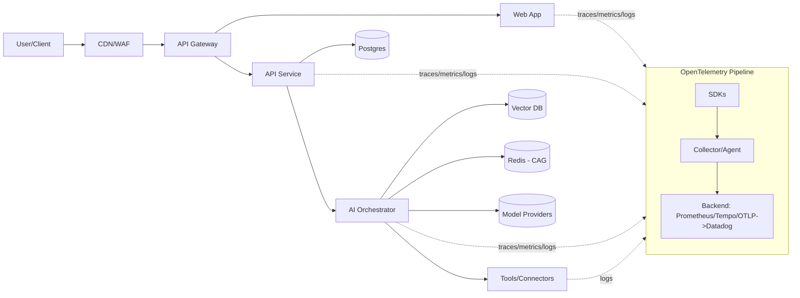

# Observability Runbook

> **Purpose.** How we detect, triage, and resolve reliability or quality issues across the platform—**including AI/agentic subsystems**—while preserving tenant isolation, privacy, and cost guardrails.

## 0) Executive Summary

- **Golden signals** (per service & per tenant): _latency (p50/p95/p99)_, _error rate_, _traffic (RPS/requests)_, _saturation (CPU/memory/queue depth)_, plus **AI signals**: _tokens, cost, model_id@version, prompt_id@version, tool_calls, drift_score_.
- **SLOs & error budgets**: Alerts fire on **burn rates**; fast-burn (high urgency) and slow-burn (capacity issues). See `SLOs.md`.
- **Trace-first debugging**: Every request has a `trace_id` and `request_id`. Propagate context across **web → API → Orchestrator → Tools → DB/Vector**.
- **AI safety & cost**: Guardrails and budgets are enforced at the orchestrator. Sudden **cost spikes** usually indicate **cache miss (CAG)**, **prompt change**, or **provider routing** drift.
- **Standard playbooks** included for API 5xx spike, latency regressions, AI provider outage, drift detection, cache hit drop, vector DB hot shard, and prompt‑injection alarms.

---

## 1) System Scope & Topology

We instrument all production components: **Web (Next.js)**, **API (FastAPI)**, **Orchestrator (Planner/Router, Tools)**, **Workers**, **Databases (Postgres, VectorDB)**, **Caches (Redis)**, **Storage**, and **3rd‑party model providers**.



**Headers & correlation (required):** `X-Request-ID`, `X-Correlation-ID`, `X-B3-TraceId`, `X-B3-SpanId`, `X-B3-Sampled`. Emit span attributes: `api.version`, `operation_id`, `status_code`, `response_time_ms`, **`model.id`**, **`model.version`**, **`prompt.id`**, **`prompt.version`**, **`tokens.input`**, **`tokens.output`**, **`cost.usd`**, **`tool.name`**, **`tool.version`**, **`tenant.id`**, **`org.id`**.

---

## 2) What to Measure (Signals & Labels)

### 2.1 Service Signals (per env / region / tenant / service)

| Metric | Target | Labels (must-have) |
|---|---|---|
| **Latency p50/p95/p99** | <100ms / <300ms / <500ms | `service`, `route`, `method`, `tenant_id`, `region`, `version` |
| **Error rate** | <0.1% overall | `service`, `route`, `status_code`, `error.type`, `tenant_id` |
| **Availability** | ≥99.95% | `service`, `env`, `region` |
| **Saturation** (CPU, Mem, Q) | <80% sustained | `service`, `pod`, `node`, `tenant_hint` |
| **Request rate (RPS)** | N/A | `service`, `route`, `tenant_id` |

### 2.2 AI/Agent Signals (per model/prompt/tool and tenant)

| Metric | Target | Labels |
|---|---|---|
| **Tokens (in/out)** | Cost trend flat or ↓ | `model_id`, `model_version`, `provider`, `prompt_id`, `prompt_version`, `tenant_id`, `agent` |
| **Cost (USD)** | Budget within PSU limits | same as above + `policy_route` |
| **Tool calls / latency** | Within SLAs | `tool.name`, `tool.version`, `tenant_id`, `agent` |
| **Grounded answer rate** | ≥95% | `agent`, `task_kind`, `retrieval.count`, `drift_score` |
| **Drift / cache hit (CAG)** | Drift < threshold; CAG ≥70% | `cache_key`, `hit/miss`, `tenant_id` |
| **Safety/guardrail events** | Near zero | `violation.type`, `policy`, `tenant_id` |

---

## 3) Instrumentation Standards

### 3.1 Tracing (OpenTelemetry)

- SDK auto‑instrumentation for **FastAPI** and **Next.js**; manual spans around long operations (tool calls, vector queries, prompts).
- Propagate headers; log `trace_id` in every log line.
- Sample rate: 10% default, **100% for error traces** and for `tenant_id` in allowlist (debug sessions).

**Python (FastAPI) example**

```python
from opentelemetry import trace
from opentelemetry.instrumentation.fastapi import FastAPIInstrumentor
from opentelemetry.sdk.trace import TracerProvider
from opentelemetry.sdk.trace.export import BatchSpanProcessor
from opentelemetry.exporter.otlp.proto.grpc.trace_exporter import OTLPSpanExporter

provider = TracerProvider()
processor = BatchSpanProcessor(OTLPSpanExporter(endpoint="otel-collector:4317", insecure=True))
provider.add_span_processor(processor)
trace.set_tracer_provider(provider)

FastAPIInstrumentor.instrument_app(app, excluded_urls="health,metrics")
```

**Node (Next.js API routes) example**

```ts
import { diag, DiagConsoleLogger, DiagLogLevel } from "@opentelemetry/api";
import { NodeSDK } from "@opentelemetry/sdk-node";
import { OTLPTraceExporter } from "@opentelemetry/exporter-trace-otlp-http";

diag.setLogger(new DiagConsoleLogger(), DiagLogLevel.INFO);
const sdk = new NodeSDK({ traceExporter: new OTLPTraceExporter({ url: process.env.OTLP_URL }) });
sdk.start();
```

### 3.2 Metrics

- Export **RED/USE** metrics and AI counters via OTLP → Prometheus (or vendor backend).
- Standard names: `http_server_duration_ms`, `http_requests_total`, `http_request_errors_total`, `process_cpu_percent`, `queue_depth`, `ai_tokens_input_total`, `ai_tokens_output_total`, `ai_cost_usd_total`, `ai_tool_latency_ms`.

### 3.3 Logging

- **JSON logs**, PII scrubbed at source; include `trace_id`, `request_id`, `tenant_id`, `user_id_hash`, and **AI fields** (model/prompt/tool versions, cost, safety flags).
- **Never** log secrets or raw prompts with PII; redact with hashes and allow opt‑in debug sampling per tenant.

---

## 4) Dashboards (canonical)

1. **API Performance** – latency p50/p95/p99, error rate, top 10 slow routes, by tenant.
2. **AI Cost & Quality** – tokens & cost by agent/model/prompt; cache hit rate; drift score; grounded‑answer rate.
3. **Tool/Vector Health** – tool call latency/error; vector query p95; hot shards; Redis ops/sec & memory.
4. **SLO Overview** – objective vs achieved; **error budget burn** gauges per service.
5. **Release Watch** – version overlays (API & model/prompt versions) vs latency/errors.
6. **Tenant Watch** – top tenants by load and cost; isolate noisy neighbors.

> Notes: Keep all dashboards environment‑scoped (prod/stage/dev) and region‑scoped.

---

## 5) Alerts & Policies

### 5.1 SLO-based Burn Alerts

- **Fast burn**: 14.4× budget over 5m and 1h windows.
- **Slow burn**: 6× budget over 1h and 6h windows.

### 5.2 Golden‑Signal Alerts (defaults)

- API latency p99 > 1s for 5m.
- Error rate > 1% for 5m (5xx or policy blocks).
- Redis/CAG hit < 50% for 10m.
- VectorDB p95 latency > 300ms for 10m.
- **AI cost**: daily spend > 2× 7‑day median or PSU budget > 90%.
- **Drift**: KL divergence > 0.1 or grounded‑answer rate < 95% for 30m.
- **Security**: spike in guardrail violations (prompt‑injection/jailbreak) over baseline.

### 5.3 Example Prometheus Rules

```yaml
groups:
- name: api-latency
  rules:
  - alert: HighP99Latency
    expr: histogram_quantile(0.99, sum(rate(http_server_duration_ms_bucket{{env="prod"}}[5m])) by (le, service)) > 1000
    for: 5m
    labels: {{service="api", severity="page"}}
    annotations: {{summary="High p99 latency in API", runbook_url="/docs/07-ops/Observability-Runbook.md#playbook-api-latency"}}
```

---

## 6) Playbooks (Top Issues)

### 6.1 API 5xx Spike

**Detect**: Error rate > 1% for 5m.  
**Triage (5–10 min)**  
1. Open **API Performance** dashboard and filter `service=api`, `tenant_id=*`.  
2. Check recent deploys (version overlay).  
3. Inspect top error traces; classify `error.type` (auth, db, timeout).  
4. Run health checks; verify DB connections and rate‑limiters.

**Mitigate**  
- Roll back last release if correlated.  
- Enable circuit breakers for failing downstreams.  
- Scale out API (HPA) if saturation.

**Root Cause**  
- File detailed issue; attach traces and metrics; link to RCA template.

### 6.2 Latency Regression (p99 ↑)

**Detect**: p99 > 1s for 5m; queue depth ↑.  
**Triage**: Check hot routes; DB slow queries; vector DB p95; tool latency.  
**Mitigate**: Warm caches; increase concurrency; tune N+1 queries; shard hot vector index; temporarily disable heavy features.  
**Verify**: p95 normalized, error rate ≤ baseline.

### 6.3 AI Provider Outage or Rate‑Limit

**Detect**: spike in `ai_provider_error_total`, tool call 429/5xx.  
**Triage**: View **AI Cost & Quality**; check `provider`, `model_id`.  
**Mitigate**: Trigger **ModelSelector** fallback; lower concurrency; backoff with jitter; route by region.  
**Communicate**: Status banner in UI; incident opened; customer comms template.  
**Post‑fix**: Re‑enable primary; compare quality metrics pre/post.

### 6.4 Cache (CAG) Hit Rate Collapse → Cost Spike

**Detect**: `cag_cache_hit_ratio` < 50% for 10m **and** daily cost ↑.  
**Triage**: Inspect last prompt/tool version change; TTL expirations; invalidation storms; tenant‑specific hot keys.  
**Mitigate**: Increase TTL; restore previous prompt/tool version; batch heavy jobs; pre‑warm.  
**Prevent**: Versioned keys; event‑driven invalidation; drift checks.

### 6.5 Vector DB Hot Shard

**Detect**: vector p95 > 300ms with uneven `shard_qps`.  
**Triage**: Identify shard; tenant load; outlier queries.  
**Mitigate**: Rebalance; increase replicas; apply ANN params; cache frequent queries.

### 6.6 Prompt‑Injection / Safety Alarms

**Detect**: Spike in `guardrail_violation_total` (injection/jailbreak).  
**Triage**: Sample traces; check tenant and route; validate filters active.  
**Mitigate**: Tighten input validation; enable stricter templates; temporarily disable risky tools; rate‑limit offender.  
**Report**: Security incident if PII risk; coordinate with Security.

### 6.7 Model Drift / Quality Drop

**Detect**: Grounded‑answer rate < 95% or eval score drop post‑release.  
**Triage**: Compare ModelCard metrics; inspect recent data changes.  
**Mitigate**: Roll back `model_id@version` or `prompt_id@version`; increase retrieval depth; refresh embeddings.  
**Follow‑up**: Add eval to prevent recurrence; update Model Card.

---

## 7) On‑Call & Escalation

- **Rotation**: Weekly; primary + secondary; daytime handoff notes.  
- **Severities**: SEV‑1 (user‑visible outage), SEV‑2 (degraded), SEV‑3 (minor).  
- **Paging**: SEV‑1: page primary immediately; create war‑room (video + chat).  
- **Communication**: Status page updates; customer comms; internal #incident channel.  
- **Post‑Incident**: RCA within 48h; track actions; link ADR if systemic change.

---

## 8) Compliance & Privacy in Telemetry

- Respect **data classification**; scrub PII at source. Do not export restricted fields.  
- Token/cost telemetry is **aggregated** by tenant; per‑user metrics are hashed/anonymized.  
- Role/access scoped dashboards; security reviews for changes.

---

## 9) Change Management

- Observability config **as code**; PRs reviewed and tested in staging.  
- Alert changes require SRE + service owner approval.  
- Version dashboards; keep diffs small and reversible.

---

## 10) Appendices

### 10.1 Health & Ready Endpoints

- `/health` (liveness), `/ready` (dependencies), `/metrics` (Prometheus).

### 10.2 Example Log Line (JSON)

```json
{
  "ts": "2025-09-21T10:30:00Z",
  "level": "INFO",
  "service": "orchestrator",
  "tenant_id": "TEN-1234",
  "trace_id": "7c9e6679-7425-40de-944b-e07fc1f90ae7",
  "route": "POST /v1/agents/plan",
  "model": {"id": "gpt-4o", "version": "2025-07-01", "provider": "openai"},
  "prompt": {"id": "planner@v3.2", "version": "3.2"},
  "tokens": {"in": 1240, "out": 380},
  "cost_usd": 0.0123,
  "tool": {"name": "graph_rag.search", "version": "1.4.0", "latency_ms": 92},
  "cache": {"cag_hit": true, "key": "tenant:plan:hash"},
  "status_code": 200,
  "latency_ms": 286
}
```

### 10.3 Run Local k6 Smoke (API)

```js
import http from 'k6/http'; import { sleep, check } from 'k6';
export const options = { vus: 10, duration: '1m' };
export default function() {
  const r = http.get('https://api.example.com/v1/health');
  check(r, { 'status is 200': (res) => res.status === 200 });
  sleep(1);
}
```

### 10.4 Glossary

- **CAG**: Cache‑Ahead‑Generation (prompt/embedding/tool/sim caches).  
- **Grounded answer**: Response supported by retrieved evidence.  
- **PSU**: Premium Simulation Unit (heavy compute budget).

---

**Review cadence:** monthly. Keep this runbook aligned with SLOs, Incident Playbooks, and Eval Plan.
