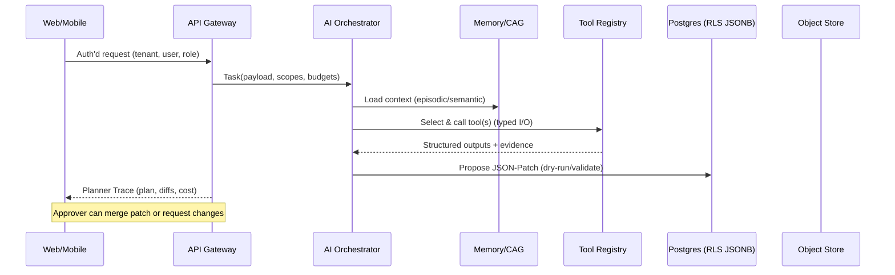
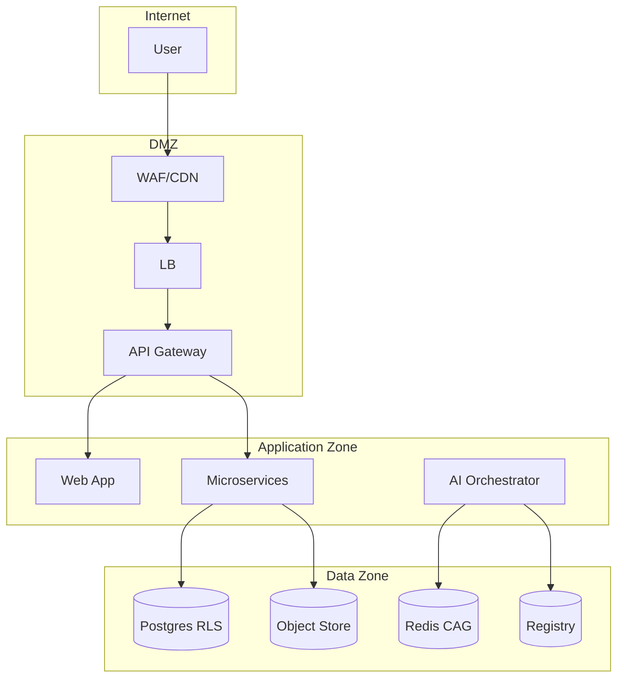

---
owner: architecture-team
last_review: 2025-09-21
status: template
tags: ["architecture", "multi-tenant", "multi-user", "multi-domain", "agentic-ai", "odl-sd"]
references:
  - "../00-product/PRD.md"
  - "../02-requirements/TRD.md"
  - "../03-apis/API-Specification.md"
  - "../03-apis/openapi.yaml"
  - "../04-data/Database-Design.md"
  - "../06-ml-ai/Model-Card.md"
  - "../06-ml-ai/Prompt-Library.md"
  - "../06-ml-ai/Tool-Specs.md"
  - "../06-ml-ai/Eval-Plan.md"
  - "../07-ops/Deployment-Infrastructure.md"
  - "../07-ops/Observability-Runbook.md"
  - "../07-ops/SLOs.md"
  - "../08-security/Security-Guidelines.md"
  - "../08-security/Threat-Model.md"
  - "../09-governance/API-Governance.md"
  - "../09-governance/Versioning-Policy.md"
  - "../09-governance/ADR/ADR-0000-template.md"
---

# System Architecture (Agentic, Multi‑Tenant, Multi‑Domain)

> **Purpose.** Canonical blueprint used to stand up new AI‑agentic platforms (engineering, property, trading, e‑commerce, PM, customer support, business assistant) with **shared foundations** and **pluggable domain modules**. This document drives design reviews, ADRs, and downstream runbooks.

## 1) Executive Summary

**Goals.** Ship a secure, scalable, low‑latency platform where specialized AI agents plan→act via deterministic tools against a **single source of truth** document model; support **multi‑tenant / multi‑user / multi‑domain** from day one.

**Key decisions.**

- **Contract‑first** integration (JSON Schema; OpenAPI; typed tool I/O).  
- **ODL‑SD‑style canonical document** as single source of truth with **JSON‑Patch** mutation pipeline and audit.  
- **Layered agent stack** (Channels → Orchestrator → Memory → Grounding/Graph‑RAG → Caching → Tools/Connectors → Services/Data).  
- **Strong tenancy** (Postgres RLS + scoped tokens + per‑tenant secrets/keys) and **RBAC with phase gates**.  
- **Observability & evals** as first‑class (traces, costs, drift, SLOs).  
- **Versioning/Governance**: SemVer across APIs/models/prompts/tools; deprecation policy; ADRs for significant changes.

## 2) Scope & Non‑Goals

**In scope**: web/mobile apps, public APIs, AI orchestration, data plane (OLTP + blob), offline field apps, model registry, prompt & tool registries, CI/CD & IaC.  
**Out of scope**: bespoke domain logic not listed in PRD/TRD; 3rd‑party UI themes; non‑critical batch analytics (delegated to data platform).

## 3) Architecture Overview

### 3.1 C4: System Context

```mermaid
C4Context
    title System Context
    Boundary(b0, "SaaS Platform (per region)") {{
      Person(u, "End Users / Tenants")
      Person(a, "Admins / Approvers")
      System_B(sys, "Agentic Platform", "Web, Mobile, APIs")
    }}
    System_Ext(idp, "Identity Provider", "OIDC/SAML")
    System_Ext(pay, "Payments/Escrow", "Stripe/Adyen + Escrow partner")
    System_Ext(ex, "External Services", "CRMs, ERPs, Market APIs")
    Rel(u, sys, "Use via Web/Mobile; API")
    Rel(a, sys, "Operate/Approve")
    Rel(sys, idp, "AuthN/AuthZ (OAuth2/OIDC)")
    Rel(sys, pay, "Checkout/Payouts/Webhooks")
    Rel(sys, ex, "Integrations/Webhooks")
```

### 3.2 C4: Containers (per region)

```mermaid
C4Container
    title Containers (GCP example)
    Container_B(web, "Web App (Next.js)", "SSR/SPA", "BFF to API")
    Container_B(mobile, "Mobile Apps (Expo)", "Field Ops/Customer")
    Container_B(api, "API Gateway (FastAPI)", "REST/Webhooks")
    Container_B(orch, "AI Orchestrator", "Planner/Router/Critic/Policy/Scheduler")
    Container_B(workers, "Workers", "Simulations, exports, emails, EPCIS")
    Container_B(cache, "Redis (MemStore)", "Sessions/CAG/ratelimits")
    Container_B(db, "Postgres (Cloud SQL)", "OLTP + JSONB (ODL‑SD docs)")
    Container_B(blob, "Object Store", "Design files, images, pdfs")
    Container_B(reg, "Model/Prompt/Tool Registry", "Registry svc or tables")
    Container_B(obs, "Observability Stack", "OTel/Logging/Tracing/Metrics")
    Container_B(sec, "Secrets & Keys", "Secret Manager/KMS")
    Rel(web, api, "HTTPS + JWT (RLS claims)")
    Rel(mobile, api, "HTTPS + JWT (offline sync)")
    Rel(api, orch, "Tool‑calling, plan/act")
    ORCH->>MEM: Load context (episodic/semantic)
    Rel(orch, cache, "CAG/queues")
    Rel(orch, reg, "Select model/prompt/tool")
    Rel(api, db, "RLS, migrations")
    Rel(api, blob, "Signed URLs")
    Rel(workers, blob, "Process & export")
    Rel(workers, ex, "3P APIs")
    Rel(api, obs, "OTel traces/metrics")
    Rel(orch, obs, "Costs/evals/drift")
    Rel(api, sec, "Secrets/keys at runtime")
```

### 3.3 Plan→Act Request Lifecycle (happy path)



## 4) Tenancy, Identity, RBAC

- **Tenancy model**: Org‑scoped data with **row‑level security** (RLS) in Postgres; tenant_id carried in JWT and enforced at DB and service layers.  
- **Users/Roles**: fine‑grained rights codes (R/W/P/A/X/S), phase gates by lifecycle (design→procurement→construction→commissioning→operations), and approver matrices.  
- **Session join** (QR/code) with audit and optional recording; least‑privilege scopes for tool execution.

> See **User & Access Structure** and **Threat Model** for the full role catalog, phase gates, and trust boundaries.

## 5) Data Contracts & Source of Truth

- **ODL‑SD canonical document** per project/portfolio stored in **JSONB**; all mutations go through **JSON‑Patch** with: `intent`, `tool_version`, `dry_run`, `evidence[]`, optimistic concurrency, and inverse‑patch for rollback.  
- **Externalized artifacts** (drawings, PDFs, images) in object storage with hashes; references kept in document.  
- **Graph‑RAG projection** maintained for grounding; event‑triggered reprojections after patches.

### 5.1 Key Stores

| Store                 | Purpose                              | Technology (default) |
|-----------------------|--------------------------------------|----------------------|
| OLTP                  | Tenanted data & ODL‑SD docs          | Postgres (Cloud SQL) |
| Cache / CAG           | Prompts, embeddings, tool outputs    | Redis Memorystore    |
| Blobs                 | PDFs, images, exports, SLDs          | Cloud Storage / S3   |
| Registry              | Models, Prompts, Tools (semver)      | DB tables or service |
| Events & Queues       | Workflows, schedulers, webhooks      | Pub/Sub              |

## 6) AI Architecture

- **ModelSelector + Policy Router**: route by task, cost, region; apply PSU budgets.  
- **Memory**: episodic (sessions) and semantic (curated notes); token‑aware windows + progressive summarization.  
- **Ground‑before‑Generate**: hybrid retrieval and **ODL Graph‑RAG**; tool‑verified answers.  
- **Deterministic Tools**: typed JSON I/O; strict validation; retry/backoff; self‑correction loop on schema violations.  
- **Planner Trace UI**: Plan cards, Critic/Verifier, Diff & Approvals exposed to users.

## 7) Domain Modularity (multi‑domain)

New platforms select a **Domain Pack** (e.g., Engineering, Trading, Property, E‑commerce, PM, Support, Biz Assistant). Each pack contributes:

- **Domain packages** (pure logic) and **tool adapters**.  
- **Data model extensions** bound under the canonical document (e.g., `finance`, `operations`, `commerce`).  
- **Specialist agents** and eval suites.  
- **UI lenses & canvases** (diagram canvases, split views).

## 8) Public APIs & Integration

- **REST (OpenAPI)** with URI versioning (`/api/v{{MAJOR}}`) and header negotiation; consumer‑driven contracts; Spectral rules.  
- **Webhooks** for payments, escrow, EPCIS, and partner events.  
- **SDKs/clients** auto‑generated from OpenAPI in CI to avoid drift.

## 9) Security & Threat Model (summary)

- **Boundaries**: Internet→DMZ (WAF/CDN), DMZ→App (JWT, gateway policies), App→Data (RLS, prepared statements), App→AI (validation, rate limits), Data→Training (provenance).  
- **Controls**: OAuth2/OIDC, RBAC, TLS 1.3, CSP/CORS, secrets vault, model signing, differential privacy where applicable, drift/abuse monitors.  
- **AI risks**: prompt injection, model extraction, data poisoning; mitigated via input/output filtering, rate limiting, watermarking, red‑team evals.

## 10) Observability, SLOs & Evals

- **Traces/metrics** via OpenTelemetry; include model id, version, tokens, cost, p50/p95/p99.  
- **Dashboards**: API health, cache hit/miss, query performance, model latency, eval pass rates, PSU budgets.  
- **SLOs**: Availability, latency, error rate; error budgets linked to release cadence.  
- **AI Evals**: grounded‑answer rate, hallucination %, domain‑specific checks (e.g., wiring rules, finance deltas).

## 11) Deployment & Environments

- **GCP‑first** reference: Cloud Run services; Cloud SQL; Memorystore; Pub/Sub; Artifact Registry; Secret Manager; Cloud Build.  
- **Environments**: dev, staging, prod with per‑region split; blue/green with canaries and rapid rollback; IaC (Terraform).  
- **CI/CD**: lint, typecheck, tests, security scans, OpenAPI client generation, spectral checks, infra plan/apply, post‑deploy smoke.

## 12) Versioning & Governance

- **SemVer** for APIs/models/prompts/tools; 12‑month support for deprecated majors, structured deprecation headers, migration guides.  
- **Governance gates**: API board, security review, performance gates; exceptions require ADRs with expiry and remediation.

## 13) Performance & Cost

- **Hot paths**: cache‑first reads; denormalized views; pagination; pre‑signed blob URLs; adaptive sampling on traces.  
- **Cost guardrails**: PSU budgets per tenant/agent; CAG hit rate targets; model swaps; autoscaling thresholds.

## 14) Risks & Open Issues

- **Cache staleness** → drift detector + event invalidation.  
- **Region residency** complexity → RegionRouter + data sharding strategy.  
- **Autonomy safety** → approver gates; JSON‑Patch dry‑runs; tool allow‑lists.  
- **Vendor lock‑in** → abstraction over model providers; exportable artifacts.

## 15) Reference Diagrams

### 15.1 Trust Boundaries & Data Flow (condensed)



## 16) Cross‑References

- **PRD**: goals, personas, KPIs.  
- **TRD**: functional & NFRs; constraints.  
- **API Spec + OpenAPI**: public interface.  
- **Data**: Database‑Design, Data‑Governance, DPIA.  
- **ML/AI**: Model‑Card, Prompt‑Library, Tool‑Specs, Eval‑Plan.  
- **Ops**: Deployment‑Infrastructure, Observability‑Runbook, SLOs, Incident‑Playbooks.  
- **Security**: Security‑Guidelines, Threat‑Model.  
- **Governance**: API‑Governance, Versioning‑Policy, ADRs.

---

## Appendix A — Implementation Hints (copy/paste)

**JWT claims (example):**
```json
{{
  "sub": "user_ulid",
  "org": "org_ulid",
  "roles": ["engineer","project_manager"],
  "scopes": ["design_read","design_write","simulation_run"],
  "tenant_id": "org_ulid",
  "region": "US"
}}
```

**OpenTelemetry trace attributes (add to every request):**
```
api.version, api.operation_id, api.status_code, api.response_time_ms,
user.id_hashed, model.id, model.version, token.input, token.output, cost.usd
```

**Tool spec (semver’d, typed I/O, example):**
```yaml
name: "wire_check"
version: "1.2.0"
inputs:
  instance_ids: {{ type: array, items: {{ type: string }} }}
outputs:
  violations: {{ type: array, items: {{ $ref: "#/defs/violation" }} }}
side_effects: "none"
rbac_scope: ["simulation_run"]
```

**JSON‑Patch wrapper (server accepts & validates):**
```json
{{
  "doc_version": "4.1.3",
  "intent": "auto_route",
  "tool_version": "auto_route@2.0.0",
  "dry_run": true,
  "evidence": ["gs://bucket/file.pdf#sha256:..."],
  "ops": [{{ "op": "replace", "path": "/instances/17/settings", "value": {{}} }}]
}}
```
