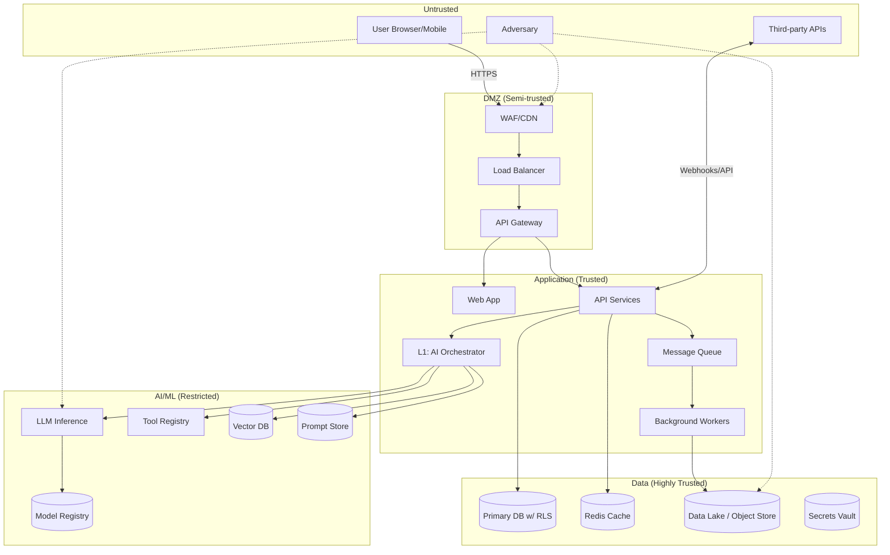

# Threat Model

> **Scope:** Multi-tenant, multi-user, multi-domain AI agentic platform (apps include engineering design, property management, trading, e‑commerce, project management, customer support, business assistant).  
> **Method:** STRIDE with AI/ML extensions (prompt-injection, model extraction, data poisoning, jailbreaks).  
> **Review cadence:** Quarterly and after material architecture changes or pen tests.

---

## 1) Executive Summary

This threat model identifies, prioritises, and mitigates security threats across web apps, APIs, AI agents/tools, data pipelines, and cloud infrastructure. It emphasises **tenant isolation**, **role‑aware access**, **tool‑guarded autonomy**, and **evidence‑backed generation (Ground‑before‑Generate)** to prevent unsafe actions and data leakage. Risk tolerance: **Low** for confidentiality & integrity; **Medium** for availability (graceful degradation is acceptable).

**Top Risks (2025):**
1) Cross‑tenant data exposure via mis‑scoped queries or vector search;  
2) Prompt‑injection leading to unsafe tool calls or exfiltration;  
3) Model extraction & sensitive output leakage;  
4) Supply‑chain compromise (packages/models/tools);  
5) Weak observability → delayed detection & response.

**Key Mitigations:** RBAC + RLS, signed & versioned tools/models, schema‑validated tool I/O, allow‑list execution, WAF + rate limits, SIEM + OTel traces (incl. model/tool IDs), dataset provenance, red‑team & evals, automatic rollbacks, zero‑trust network segmentation.

---

## 2) System Overview & Trust Boundaries

### 2.1 High‑Level Data Flow



### 2.2 Trust Boundaries & Controls

| Boundary | Description | Primary Controls |
|---|---|---|
| Internet → DMZ | Public ingress | WAF/CDN, DDoS, TLS 1.3, rate limits, bot & IP reputation |
| DMZ → App | Authenticated traffic | OAuth2/OIDC (MFA), JWT validation, CSRF & CORS, API gateway policies |
| App → Data | Data access | **Row‑Level Security** (tenant_id), prepared statements, secrets manager, envelope encryption |
| App → AI/ML | Agent calls & tools | Tool allow‑list, JSON Schema validation, output filtering, timeouts, per‑model rate limits |
| Data → Training | Data lifecycle | Provenance & lineage, PII scrub, differential privacy (where applicable), drift detection |
| External APIs | Suppliers/CRMs/etc. | Outbound egress policies, token scopes, webhook verification, retries & circuit breakers |

---

## 3) Assets, Identities, & Assumptions

**Crown Jewels:**
- Customer data & designs (including ODL‑SD docs), orders/payments, supplier pricing, audit & signatures, model artifacts, prompt library, tool registry.

**Identities & Roles:**
- End users (multi‑tenant), organisation admins, suppliers, field techs, approvers, service accounts, CI/CD robots, AI agents.

**Security Assumptions:**
- All mutations occur via **JSON‑Patch** under RBAC gates; tools are deterministic and versioned; models & tools are signed; every request is traced and auditable.

---

## 4) STRIDE Threat Analysis (Prioritised)

> Risk score uses **Likelihood × Impact** (1–3 each). 1–3 Low, 4–6 Medium, 7–9 High.

### 4.1 Cross‑cutting (applies to most apps)

| Threat (STRIDE) | Asset | L | I | Risk | Mitigations & Preventive Controls | Detection/Response |
|---|---:|---:|---:|---:|---|---|
| **Spoofing** – token theft/session hijack | Accounts | 2 | 3 | **6** | OIDC + MFA, short‑lived access tokens, refresh rotation, device binding, TLS everywhere | Anomalous login alerts, step‑up MFA, session revocation |
| **Tampering** – schema‑bypass writes | Data | 2 | 3 | **6** | JSON‑Schema/DTO validation on all inputs; **JSON‑Patch** only; approver gates for sensitive sections | WAF rules, 4xx/5xx spikes, audit diff review |
| **Repudiation** – missing audit | Audit | 2 | 3 | **6** | Append‑only logs (hash‑chained), clock sync, user & tool IDs captured per op | SIEM correlations, integrity checks |
| **Information Disclosure** – cross‑tenant leak | PII, designs | 2 | 3 | **6** | Tenant stamping end‑to‑end, DB **RLS**, per‑tenant keys, scoped caches/VectorDB namespaces | Canary docs/tests; anomaly queries |
| **DoS** – resource exhaustion | APIs/LLM | 3 | 2 | **6** | Global & per‑tenant rate limits, circuit breakers, autoscaling, cost/PSU budgets | Saturation alerts, autoscale events |
| **Elevation of Privilege** – role abuse | All | 1 | 3 | **3** | RBAC w/ least‑privilege, admin actions gated by approvals & MFA | RBAC drift reports, admin action alerts |

### 4.2 AI/ML‑specific

| Threat | Target | L | I | Risk | Mitigations | Detection/Response |
|---|---|---:|---:|---:|---|---|
| Prompt‑Injection / Goal Hijack | LLM + Tools | 3 | 3 | **9** | System prompts with **contract‑first** tool schemas; content sanitisation; tool allow‑list; reflection/critic step; output filters; no `eval()` | Guardrail hits, tool‑abuse alerts, human‑in‑the‑loop gate |
| Jailbreaks | Safety filters | 2 | 3 | **6** | Red‑team suites; policy router; safe defaults | Blocked prompt logs; eval regressions |
| Model Extraction | Deployed endpoints | 2 | 3 | **6** | Rate limits, watermarking/fingerprinting, response randomisation where safe | Query‑pattern analytics, takedown workflow |
| Data Poisoning | Training/Memory | 2 | 3 | **6** | Dataset provenance, quarantines, anomaly detection, human review, signed ingestion | Drift detectors, lineage diffing |
| Model Inversion / Membership Inference | Outputs | 1 | 3 | **3** | DP/noising where feasible, output suppression for sensitive entities | Privacy evals; alerts on over‑specific answers |
| Tool Misuse / Side‑effects | External systems | 2 | 3 | **6** | Side‑effect metadata in tool specs; dry‑run & approvals; RBAC scopes per tool | Tool runbooks; rollback/undo (JSON‑Patch inverse) |

### 4.3 Multi‑tenancy focus

| Threat | Vector | Risk | Mitigations |
|---|---|---:|---|
| Cross‑tenant query | Missing tenant filter/claim forgery | **High** | RLS in DB; tenant_id stamped in JWT & downstream; scoped caches and **VectorDB namespaces**; pen‑tests with canary tenants |
| Cross‑tenant memory bleed | Shared conversation context | **Medium** | Per‑tenant & per‑user memory keys; PII scrub; encryption; TTL & summarisation with scrubbed summaries |
| Cross‑tenant logs | Shared logs/SIEM | **Medium** | Data‑class tags; hashing/pseudonymisation; per‑tenant log streams where required |

---

## 5) Controls Catalog (mapped to risks)

### 5.1 Identity & Access
- OAuth2/OIDC with MFA; JWT w/ claims for `tenant_id`, `org_id`, `roles`, `scopes`; short‑lived tokens; refresh rotation.  
- RBAC + **phase/approval gates**; admin & tool scopes separated; least privilege; periodic access reviews.

### 5.2 Application & API
- WAF, strict CORS, input validation, **URI‑versioned APIs**, deprecation headers, and Spectral governance rules.  
- Rate‑limiting (per‑user, per‑IP, per‑model), idempotency on POST, consistent error types.  
- **OpenAPI‑driven contracts**; contract tests and consumer‑driven pact checks.

### 5.3 Data & Privacy
- **Row‑Level Security** in Postgres; envelope encryption, KMS; backup encryption and rotation.  
- Data classification; retention schedules; DPIA linkage; DSAR export workflows.  
- Vector DB namespace per tenant + hashing of sensitive embeddings; memory PII scrub.

### 5.4 AI/ML
- **Tool Registry** with JSON Schema I/O, side‑effect tags, RBAC scopes; never execute generated code.  
- Model registry + **signing & hash verification** on load; **blue‑green/rollback** with drift monitors.  
- **Ground‑before‑Generate**: retrieval & evidence required before generation; critic/verifier step.  
- Prompt registry & versioning; output filters; safety & bias eval suites.

### 5.5 Infra & Supply Chain
- IaC with code review; container image scanning; SBOM/SCA; non‑root containers; secrets vault.  
- Network segmentation (DMZ/App/Data/AI); egress controls; API allowlists; Webhook signature checks.

### 5.6 Observability & Response
- **OpenTelemetry** traces/logs/metrics with `trace_id`, `user_id` (hashed), `model_id`, `model_version`, `tool_id`, cost & latency.  
- SIEM pipelines; anomaly alerts; error budgets & SLOs; **incident playbooks** and tabletop exercises.

---

## 6) Validation & Testing

| Test | Cadence | Tools/Notes |
|---|---|---|
| AppSec (OWASP Top 10) | Monthly | ZAP/Burp, SAST/DAST, dependency scans |
| API Governance | CI + pre‑prod | Spectral rules; contract tests; can‑I‑deploy checks |
| Load & Chaos | Monthly | k6/Gatling; chaos experiments for queues/AI endpoints |
| AI Red‑Team & Safety Evals | Monthly & on model/prompt changes | Prompt‑attack corpora, jailbreak suites, bias/grounding evals |
| Privacy & DPIA Reviews | Quarterly | DSAR drills; PII scans; retention checks |
| Penetration Tests | Semi‑annual | External vendor + post‑mortems |
| DR/BCP Exercises | Annual | Backup restore drills; region failover tests |

---

## 7) Risk Register (template)

```yaml
- id: SEC-001
  title: Cross-tenant data leak via mis-scoped query
  category: Information Disclosure
  likelihood: 2
  impact: 3
  risk: 6
  mitigations: [RLS, tenant_claims, vector_namespace, tests_canary]
  owner: security
  status: Mitigated
  review: {next: "2026-01-15"}

- id: AI-004
  title: Prompt injection causes unsafe tool call
  category: AI
  likelihood: 3
  impact: 3
  risk: 9
  mitigations: [tool_allowlist, schema_validation, critic_verifier, output_filter]
  owner: ml-team
  status: In-Progress
```

---

## 8) Implementation Hooks (make it real)

- **Gateway**: Enforce `tenant_id` claim → inject DB RLS; attach `trace_id` and `user_hash`.  
- **Orchestrator**: Only declares & calls **registered tools**; schemas validate inputs/outputs; record `tool_id`, `side_effects`, and RBAC scope on each call.  
- **Model Loader**: Verify model signature & hash; record `model_id`/`version`; enable automatic rollback policy.  
- **Vector/Mem**: Prefix keys & indexes with `{tenant_id}/{org_id}/{user_id}`; scrub/aggregate PII in summaries.  
- **Audit**: Hash‑chain log entries; expose JSON‑Patch diffs for approvals; export for SIEM.  

---

## 9) Incident Playbooks (linkage)

| Scenario | Trigger | First Actions | Escalation |
|---|---|---|---|
| Cross‑tenant leak suspected | Alert from canary doc or anomaly | Isolate tenant, block offending queries, snapshot logs | Security on‑call, data‑team, legal |
| Prompt‑injection abuse | Guardrail hit + tool call anomaly | Disable affected tool, rotate keys, purge prompts | ML on‑call, product |
| Model exfiltration attempt | Rate spikes + pattern match | Throttle/rate‑limit, watermark analysis | Security + ML, comms |
| Compromised supplier key | Error spikes from webhook/API | Revoke & rotate creds; suspend supplier access | Platform + Supplier Manager |

---

## 10) References

- Security Guidelines (controls & enforcement) – see `../Security-Guidelines.md`  
- Incident Playbooks – see `../../07-ops/Incident-Playbooks.md`  
- API Governance & Spectral rules – see `../../09-governance/API-Governance.md`  
- DPIA – see `../../04-data/DPIA.md`  

---

## 11) Change Log

- 2025-09-22 — Initial version of consolidated, AI‑aware STRIDE threat model for multi‑tenant agentic platform.
