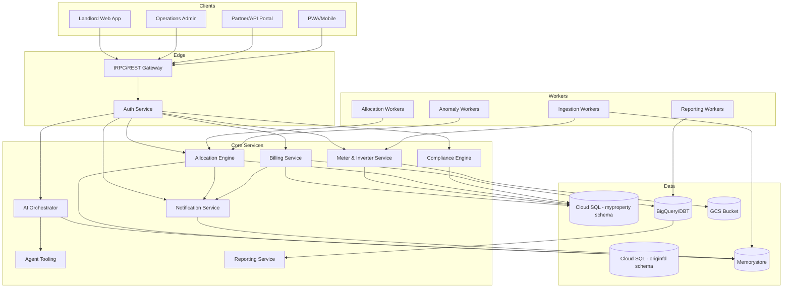

---
owner: architecture-team
last_review: 2025-09-25
status: draft
tags: ["architecture", "system-design", "gcp"]
references:
  - "../../nexzo-myproperty-concept.md"
  - "../../Nexzo MyProperty & OriginFD Integration Plan.md"
  - "../00-product/PRD.md"
  - "../02-requirements/TRD.md"
  - "../03-apis/API-Specification.md"
  - "../04-data/Database-Design.md"
  - "../07-ops/Deployment-Infrastructure.md"
---

# System Architecture

## 1. Overview
Nexzo MyProperty is a multi-tenant SaaS platform that unifies property operations, solar energy allocation, billing, and service orchestration. The platform is built as a modular monorepo with Next.js frontends, TypeScript/Node APIs, Python AI services, and background workers. It runs on Google Cloud Platform, sharing baseline infrastructure patterns with OriginFD while maintaining isolated schemas and services.

## 2. Logical Architecture

## 3. Deployment Topology
- **Apps:** Deployed to Vercel (web/docs) and Cloud Run (admin). Static docs-site uses Next.js static export hosted on Vercel.
- **Gateway Node:** Edge service on Cloud Run handling REST/tRPC, BFF for web/mobile, WebSocket for copilot chat.
- **AI Python:** FastAPI-based orchestrator on Cloud Run with GPU-enabled variant for heavy inference (optional).
- **Services:** Billing, auth, compliance, meter, notify run as independent Cloud Run services with autoscaling policies (min 1, max 10 for MVP).
- **Workers:** Pub/Sub-triggered Cloud Run jobs for ingestion, allocation, anomaly detection, and scheduled reports (Cloud Scheduler).
- **Shared Resources:** Cloud SQL (Postgres 14) with separate schemas (`myproperty`, `originfd`), Redis (Memorystore) for caching/queues, GCS for document storage, BigQuery for analytics.
- **Networking:** Private VPC connectors, Serverless VPC Access; public endpoints only for web frontends and gateway; internal services use IAM auth.

## 4. Integration with OriginFD
- **Identity:** Shared SSO and JWT issuer; tokens include `domains` claim controlling MyProperty vs OriginFD access.
- **Project Lifecycle:** MyProperty triggers OriginFD project creation via REST API; listens to OriginFD webhooks for status updates, capacity, and completion metadata.
- **Shared Schema Contracts:** `property_project_link` table maintained within MyProperty schema referencing OriginFD projects. Contract tests ensure referential integrity.
- **Infrastructure Alignment:** Follows OriginFD Cloud Run/Cloud Build patterns for CI/CD, secrets management, scaling, and monitoring.

## 5. Data Flow Summary
1. **Ingestion:** Kafka/PubSub topics ingest meter/inverter telemetry; ingestion workers normalise and persist to time-series store, update caches.
2. **Allocation:** Allocation service calculates solar vs grid usage per unit, writes ledger entries, triggers anomaly detection comparisons.
3. **Billing:** Billing service composes invoices, applies compliance rules, pushes to Stripe, writes ledger rows, notifies stakeholders.
4. **AI Copilot:** Orchestrator fetches context from Postgres, Redis caches, and warehouse views, executes tool calls (allocation adjustment, create ticket, simulate ROI).
5. **Reporting:** Nightly jobs aggregate data into warehouse marts, produce landlord statements and compliance reports.

## 6. Security & Compliance Controls
- **Authentication:** OIDC login, short-lived JWT access tokens, refresh tokens stored server-side (Redis) with revocation lists.
- **Authorization:** Multi-tenant RBAC enforced across gateway and services; RLS policies in Postgres; service-to-service mutual auth using service accounts.
- **Data Protection:** Encryption in transit (TLS 1.3) and at rest; secrets stored in Secret Manager; rotating Stripe keys; audit logging for PII access.
- **Compliance:** Compliance engine selects regional rate/rule packages from `rulesets/`, ensures required disclosures delivered via Docs-Site and tenant portal.

## 7. Observability
- Centralised tracing via OpenTelemetry exporter to Cloud Trace.
- Structured logs with `tenant_id`, `property_id`, `trace_id` for correlation.
- Metrics exported to Cloud Monitoring (latency, error rates, allocation drift, Stripe errors, AI tool latencies).
- Alerting defined in `../07-ops/SLOs.md` and runbooks in `../07-ops/Observability-Runbook.md`.

## 8. Future Considerations
- Evaluate dedicated timeseries DB (Influx/Timescale) if ingestion volume exceeds Postgres partition capacity.
- Evaluate multi-region active-active for high-availability regions; current design supports warm standby with point-in-time recovery.
- Expand agent runtime to support on-prem connectors via Agents package once enterprise customers require.

Keep this document aligned with actual deployments and ADRs.
