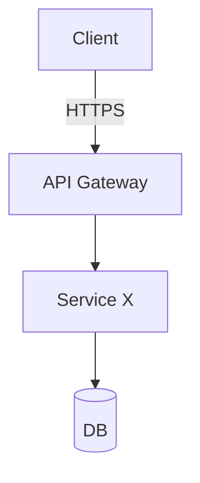
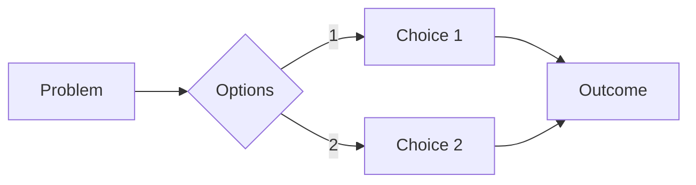

# ADR-0000: <Short Title of Decision>

> **Purpose**: Record a single architectural decision, the options considered, trade‑offs, and the outcome.  
> **Use this for**: platform‑wide choices (data model, tenancy pattern, orchestration, tool contracts), or any change that affects APIs, security posture, or operating cost.

---

## 0) Quick-Fill Checklist (delete after use)

- [ ] Executive summary completed in 3–5 sentences
- [ ] Problem context & constraints captured
- [ ] Options compared with **weighted** matrix
- [ ] AI/agent safety & governance implications addressed
- [ ] Multi‑tenant, multi‑user, multi‑domain impact stated
- [ ] Versioning & compatibility plan defined (SemVer, deprecation)
- [ ] Rollout + rollback plan defined
- [ ] Success metrics & evaluation hooks wired to Observability/Eval Plan
- [ ] Links to TRD, System Architecture, API spec, Threat Model verified

---

## 1) Metadata

**Date**: YYYY‑MM‑DD  
**Status**: _Proposed_ | _Accepted_ | _Deprecated_ | _Superseded_  
**Superseded by**: ADR‑NNNN (if any)  
**Decision Makers**: <names/roles>  
**Technical Story / Ticket**: <link to issue/epic>  

---

## 2) Executive Summary

<Write one paragraph explaining the decision, the core rationale, and the impact on users, operators, and cost.>

---

## 3) Context & Problem Statement

**What decision is needed? Why now? Who is affected?**  
Provide 2–3 paragraphs of background, current limitations, and the business/technical forces at play.

### 3.1 Scope
- **In scope**: <systems, services, components, tenants, domains>
- **Out of scope**: <explicit exclusions>

### 3.2 Requirements (from TRD)
| Requirement | Priority | Description | Success Criteria |
|---|---|---|---|
| FR‑1 | MUST | … | … |
| FR‑2 | SHOULD | … | … |
| NFR‑1 | MUST | e.g., p99 latency < 500ms | verified in SLO dashboard |
| NFR‑2 | SHOULD | e.g., cost / request <$0.001 | traced & budgeted |

### 3.3 Constraints
- **Technical**: e.g., must run on Cloud Run; Postgres + Redis are standard
- **Business**: budget cap, delivery deadline
- **Regulatory**: GDPR/PII residency; DPIA outcomes
- **Organizational**: team skills, vendor contracts

---

## 4) Decision Drivers (Quality Attributes)

List the forces that guide the choice.

1) Performance/latency 2) Scalability & multi‑tenancy isolation 3) Security & compliance  
4) Maintainability & developer ergonomics 5) Cost efficiency 6) Time‑to‑market

> Optional: Prioritize attributes and set target metrics.

| Attribute | Priority | Target / Guardrail | Trade‑off Allowed? |
|---|---|---|---|
| Performance | High | p99 < 500ms | No |
| Scalability | High | 10× growth w/o redesign | No |
| Security | High | Zero critical vulns | No |
| Maintainability | Med | <2 days onboarding | Yes |
| Cost | Med | <$10k / month | Yes |

---

## 5) Considered Options

> Add/rename options as needed. Option 3 is usually **Status Quo**.

### Option 1 — <Name>
**Description**: 1–2 paragraphs.

**Architecture Sketch (optional):**


**Pros**
- ✅ …
- ✅ …

**Cons**
- ❌ …
- ❌ …

**AI/Agent Safety & Governance**
- Guardrails: tool contracts, JSON schema I/O, rate limits
- Ground‑before‑generate, critic/verifier checks
- RBAC/phase gates on JSON‑Patch mutations
- Eval hooks & drift/abuse monitoring

**Security & Privacy**
- STRIDE notes, data classification, secrets, tenant isolation

**Ops & Observability**
- Metrics, traces, logs, budgets; rollouts & playbooks

**Effort / Risk / Cost**
- Effort: S/M/L/XL; Risk: Low/Med/High; Cost: one‑off + recurring

---

### Option 2 — <Name>
<Mirror the structure above>

---

### Option 3 — Status Quo
**Description**: Keep current implementation.

**Pros**: no change risk; familiar.  
**Cons**: does not solve problem; debt accrues; opportunity cost.

---

## 6) Decision Matrix (Weighted)

> Tune weights to your priorities. Fill 0–10 per option; compute weighted average.

| Criteria | Weight | Opt‑1 | Opt‑2 | Opt‑3 | Notes |
|---|---:|---:|---:|---:|---|
| Performance | 0.30 |  |  |  |  |
| Scalability | 0.25 |  |  |  |  |
| Complexity (lower=better) | 0.20 |  |  |  |  |
| Cost (3‑yr TCO) | 0.15 |  |  |  |  |
| Time to market | 0.10 |  |  |  |  |
| **Total** | **1.00** |  |  |  |  |

> **Formula**: `Total = Σ(score × weight)`

---

## 7) Decision Outcome

**Chosen Option**: <Option N — Name>  
**Rationale**: Summarize 3–5 bullets explaining the trade‑offs and why this option wins.  
**Impact**: Enumerate affected services/teams/processes.

---

## 8) Implementation Plan

**Phase 0 — Foundations (Week 1–2)**  
- [ ] Spikes/PoC; schema/contracts written; security review

**Phase 1 — Development (Week 3–6)**  
- [ ] Implement core; tests; docs; feature flags

**Phase 2 — Deployment (Week 7–8)**  
- [ ] Staging rollout; performance & chaos tests; production launch

**Ops Hooks**  
- [ ] Dashboards & alerts wired (Observability Runbook)  
- [ ] SLOs tracked; error budgets agreed  
- [ ] Incident playbook updated

---

## 9) Versioning & Compatibility

State **SemVer** for APIs/models/prompts/tools; deprecation policy; support windows.  
Provide migration path & compatibility shims if applicable.

**Breaking changes**: <list>  
**Deprecation timeline**: <announce → migrate → warn → sunset → remove>

---

## 10) Risk Analysis & Mitigations

| Risk | Likelihood | Impact | Mitigation | Owner |
|---|---|---:|---|---|
| … | Low/Med/High | … | … | … |

**Rollback Plan**  
- Trigger thresholds; exact steps to revert; data preservation; comms plan.

---

## 11) Security, Privacy & Compliance

- Threats & STRIDE notes; tenant isolation; secrets handling  
- Data classification; DPIA references; regional residency controls  
- Model/prompt/tool safety checks; abuse/jailbreak defenses

---

## 12) Evaluation & Success Metrics

Define how success will be measured and monitored (tie to Eval Plan & Observability).

| Metric | Current | Target | Measurement | Review Date |
|---|---|---|---|---|
| p99 latency |  |  | tracing |  |
| Error rate |  |  | error tracker |  |
| Cost / req |  |  | token+calls dashboards |  |
| AI quality |  |  | eval suite (offline/online) |  |
| Developer DX |  |  | survey/onboarding time |  |

---

## 13) Governance & Exceptions

- API governance checks; linting (Spectral rules); contract tests  
- Exception process (who approves; expiry; remediation)  
- Required ADRs to supersede/change this decision

---

## 14) Appendices

### A) JSON‑Patch Contract (if mutating ODL‑SD or configs)
```json
{
  "doc_version": "x.y.z",
  "dry_run": true,
  "intent": "short description",
  "tool_version": "name@1.2.3",
  "evidence": ["uri://datasheet.pdf#p=3"],
  "ops": [
    { "op": "replace", "path": "/instances/0/name", "value": "INV‑001" }
  ]
}
```

### B) Mermaid Decision Diagram (optional)


### C) Changelog
- YYYY‑MM‑DD: Created (status: Proposed)
- YYYY‑MM‑DD: Accepted
- YYYY‑MM‑DD: Superseded by ADR‑NNNN
