# NexzoMyProperty - Comprehensive Concept Document

## Executive Vision

**NexzoMyProperty** is an AI-powered, solar-integrated property management ecosystem that revolutionizes how landlords manage utilities, tenants experience transparency, and service providers deliver value. Built on the principle of **"Every kWh Traceable, Fair, and Optimizable,"** it transforms property management from a manual, dispute-prone process into an automated, insight-driven experience.

### Core Value Propositions

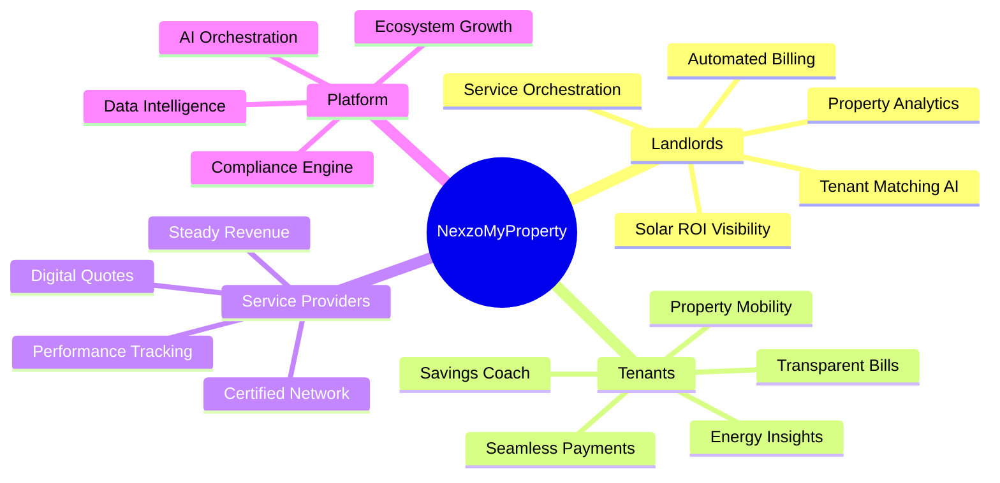

## 1. Platform Architecture & Ecosystem

### 1.1 Multi-Stakeholder Ecosystem

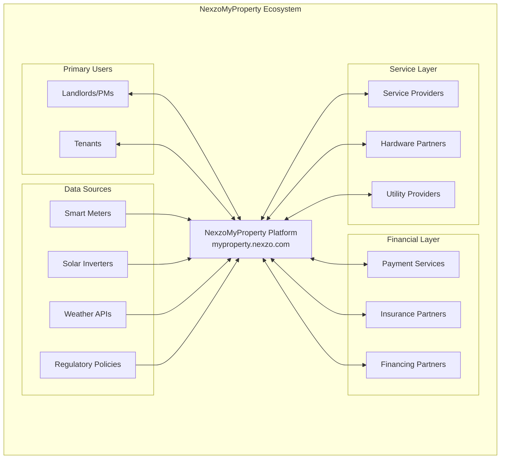

### 1.2 AI Agent Architecture

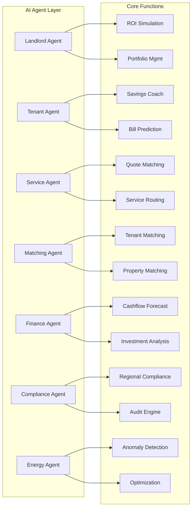

## 2. Core Functionality Streams

### 2.1 Energy Management & Billing Flow

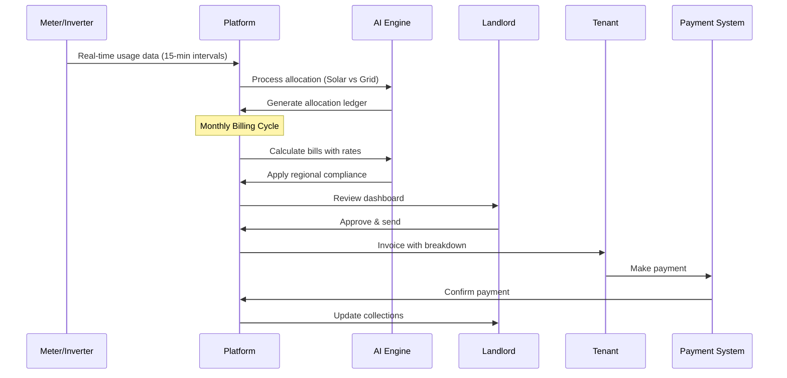

### 2.2 Service Request Lifecycle

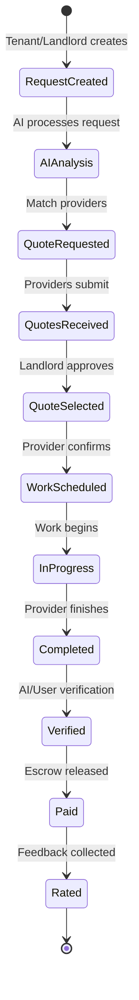

## 3. Enhanced Feature Set

### 3.1 Landlord Command Center

#### **Core Capabilities**
- **Portfolio Dashboard**: Multi-property overview with KPIs
- **Energy Intelligence**: Real-time solar generation, consumption patterns
- **Financial Analytics**: NOI tracking, expense categorization, tax reports
- **Tenant Lifecycle**: Automated screening, onboarding, renewal management
- **Maintenance Orchestration**: Predictive maintenance, service provider matching

#### **Advanced Features** (New Additions)
- **Virtual Property Tours**: AI-generated tours from uploaded media
- **Dynamic Pricing Engine**: Market-based rent optimization
- **Carbon Credit Tracking**: Monetize sustainability improvements
- **Property Comparison Tool**: Benchmark against similar properties
- **Automated Lease Generation**: AI-powered, jurisdiction-specific documents

### 3.2 Tenant Experience Portal

#### **Core Capabilities**
- **Transparent Billing**: Itemized utilities with solar credits
- **Usage Analytics**: Daily patterns, peer comparisons
- **Payment Hub**: Multiple payment methods, autopay, payment plans
- **Service Requests**: Video-based submissions, tracking
- **Document Vault**: Lease, receipts, correspondence

#### **Advanced Features** (New Additions)
- **Savings Challenges**: Gamified energy reduction with rewards
- **Community Board**: Building-wide announcements, events
- **Moving Assistant**: End-to-end relocation support within platform
- **Credit Building**: Report on-time payments to credit bureaus
- **Utility Budget Planner**: AI-powered monthly budget recommendations

### 3.3 Service Provider Network

#### **Core Capabilities**
- **Job Matching**: AI-based assignment by skills, location, rating
- **Digital Quoting**: Video walkthrough, competitive bidding
- **Performance Tracking**: SLA monitoring, quality scores
- **Payment Processing**: Escrow-based, milestone payments

#### **Advanced Features** (New Additions)
- **Certification Program**: Platform-specific training and badges
- **Inventory Management**: Parts tracking and procurement
- **Route Optimization**: AI-scheduled multi-property visits
- **Preferred Provider Tiers**: Volume-based benefits
- **Knowledge Base**: Best practices, troubleshooting guides

## 4. Data Intelligence Layer

### 4.1 Predictive Analytics Framework

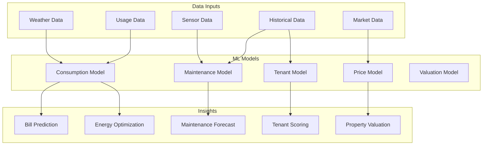

### 4.2 Real-Time Monitoring Dashboard

**Key Metrics Tracked:**
- Energy consumption vs. solar generation (real-time)
- Occupancy rates and tenant satisfaction scores
- Maintenance response times and costs
- Payment collection rates
- Carbon footprint reduction
- ROI on property improvements

## 5. Compliance & Security Framework

### 5.1 Multi-Jurisdictional Compliance Engine

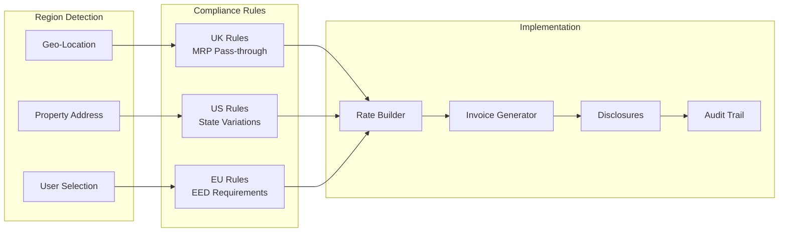

### 5.2 Security Architecture

- **Data Encryption**: End-to-end encryption for all sensitive data
- **Role-Based Access Control (RBAC)**: Granular permissions
- **Multi-Factor Authentication**: Mandatory for financial operations
- **Audit Logging**: Immutable transaction logs
- **GDPR/CCPA Compliance**: Data portability and deletion rights
- **Blockchain Option**: Immutable billing records for high-trust scenarios

## 6. Growth & Monetization Strategy

### 6.1 Revenue Streams

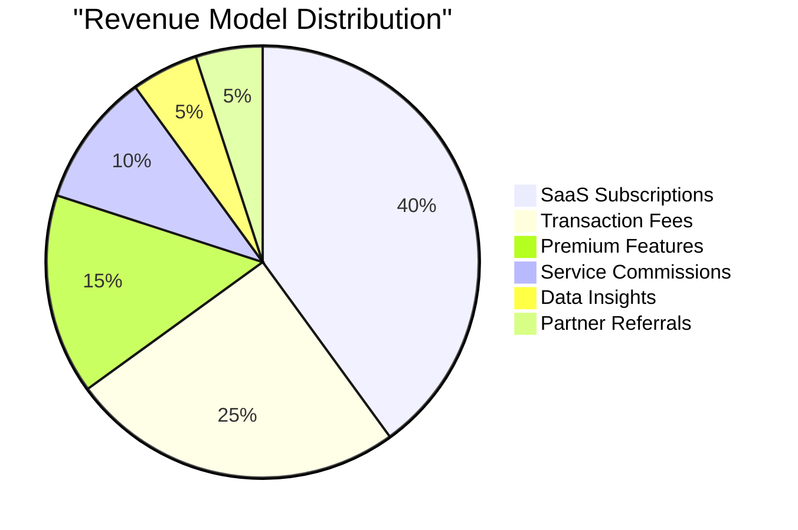

### 6.2 Platform Pricing Tiers

| Tier | Target | Features | Pricing |
|------|---------|----------|---------|
| **Starter** | 1-5 units | Basic billing, tenant portal | Free |
| **Growth** | 6-20 units | + Solar allocation, AI insights | $5/unit/mo |
| **Professional** | 21-100 units | + ROI simulator, service network | $4/unit/mo |
| **Enterprise** | 100+ units | + Custom compliance, API access | $3/unit/mo |
| **Service Provider** | All sizes | Job matching, payment processing | 5% commission |

## 7. Implementation Roadmap

### Phase 1: Foundation (Months 0-3)
- Core billing engine with meter integration
- Basic landlord and tenant portals
- UK/US compliance profiles
- Stripe payment integration
- MVP solar allocation

### Phase 2: Intelligence (Months 4-6)
- AI forecasting and anomaly detection
- Service provider network launch
- ROI simulator
- Advanced billing (TOU, tiered rates)
- Mobile PWA optimization

### Phase 3: Ecosystem (Months 7-12)
- Digital lease management
- Multi-utility support
- Demand response integration
- Community features
- ESG reporting

### Phase 4: Scale (Year 2)
- International expansion
- White-label options
- Blockchain audit trail
- EV charging integration
- Property marketplace

## 8. Competitive Advantages

### 8.1 Unique Differentiators

1. **Solar-First Architecture**: Only platform with native PV allocation ledger
2. **Agentic AI Layer**: Autonomous agents for each stakeholder
3. **Compliance Engine**: Region-aware, auto-adapting rules
4. **Ecosystem Approach**: Integrated service providers, utilities, finance
5. **Transparency Focus**: Complete visibility for all parties

### 8.2 Market Positioning

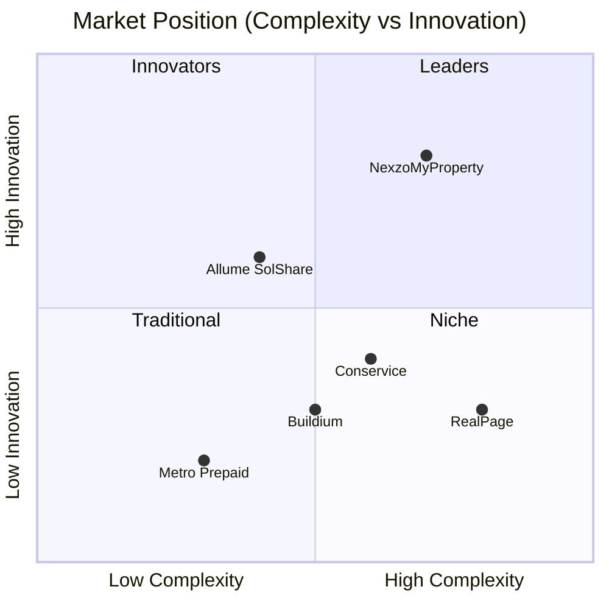

## 9. Success Metrics & KPIs

### 9.1 Platform Health Metrics

| Metric | Target (Year 1) | Target (Year 2) |
|--------|-----------------|-----------------|
| Active Properties | 10,000 | 50,000 |
| Monthly Active Users | 50,000 | 250,000 |
| Transaction Volume | $10M | $100M |
| NPS Score | >70 | >80 |
| Churn Rate | <5% | <3% |
| Service Provider Network | 500 | 2,500 |

### 9.2 Impact Metrics

- **Energy Savings**: 15% average reduction in tenant consumption
- **Solar ROI**: 20% improvement in landlord solar payback
- **Dispute Resolution**: 75% reduction in billing disputes
- **Payment Velocity**: 50% faster collection cycles
- **Maintenance Efficiency**: 30% reduction in resolution time

## 10. Future Vision & Expansion

### 10.1 Platform Evolution

**Near-term (1-2 years)**
- AI Property Valuation Engine
- Virtual Property Management (remote landlords)
- Tenant Mobility Network (seamless moving)
- Energy Trading Platform (peer-to-peer solar credits)

**Long-term (3-5 years)**
- Smart City Integration
- Autonomous Property Management
- Predictive Tenant Matching
- Carbon Neutral Property Certification
- Global Property Exchange

### 10.2 Technology Roadmap

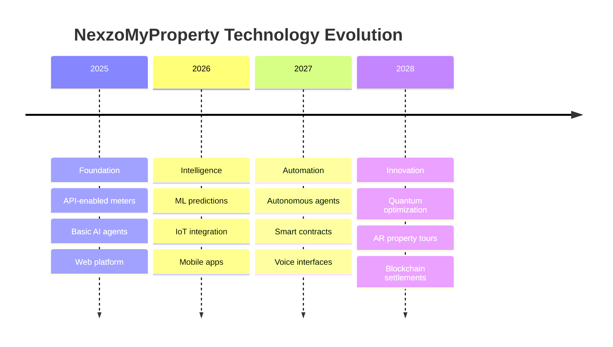

## 11. Risk Mitigation Strategy

| Risk | Mitigation |
|------|------------|
| Regulatory Changes | Modular compliance engine, legal advisory board |
| Hardware Fragmentation | Universal adapter framework, provider certification |
| Data Privacy Concerns | Zero-knowledge architecture options, transparent policies |
| Market Competition | Fast innovation cycles, ecosystem lock-in |
| Adoption Resistance | Freemium model, white-glove onboarding |

## 12. User Journey Maps

### 12.1 Landlord Journey

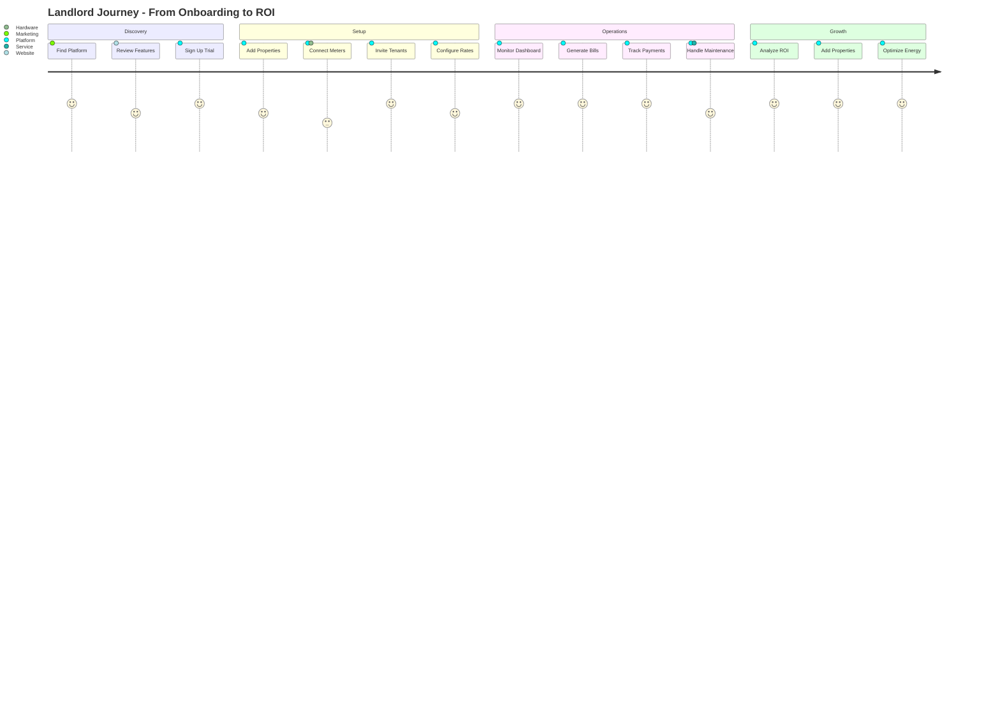

### 12.2 Tenant Journey

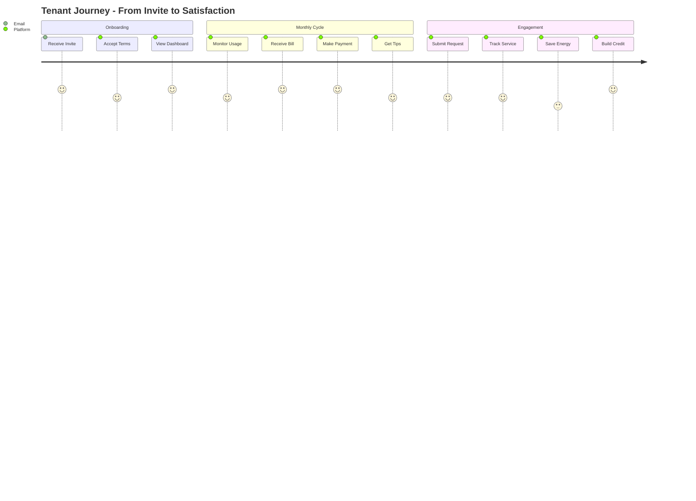

## 13. Technical Architecture Details

### 13.1 System Components

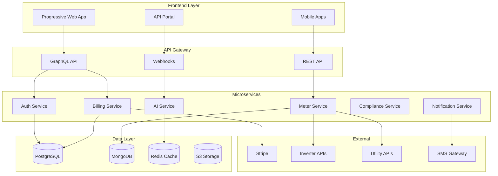

### 13.2 Data Flow Architecture

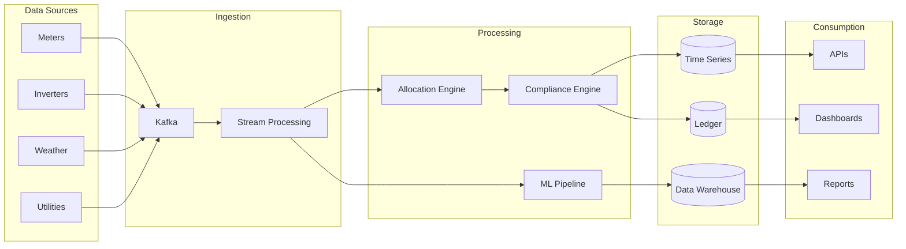

## 14. Partnership & Integration Strategy

### 14.1 Strategic Partnerships

| Partner Type | Examples | Integration Level | Value Exchange |
|--------------|----------|-------------------|----------------|
| **Hardware** | Enphase, SolarEdge, Fronius | Deep API | Data access, certification |
| **Payment** | Stripe, GoCardless, PayPal | Transaction | Processing, compliance |
| **Property Mgmt** | Yardi, Buildium, AppFolio | Data sync | Customer base, workflows |
| **Insurance** | Lemonade, State Farm | Referral | Risk mitigation, premiums |
| **Smart Home** | Nest, Ecobee, Ring | Control API | Energy optimization |
| **Utilities** | Regional providers | Data API | Bill data, rates |
| **Credit Bureaus** | Experian, TransUnion | Reporting | Tenant credit building |

### 14.2 API Ecosystem

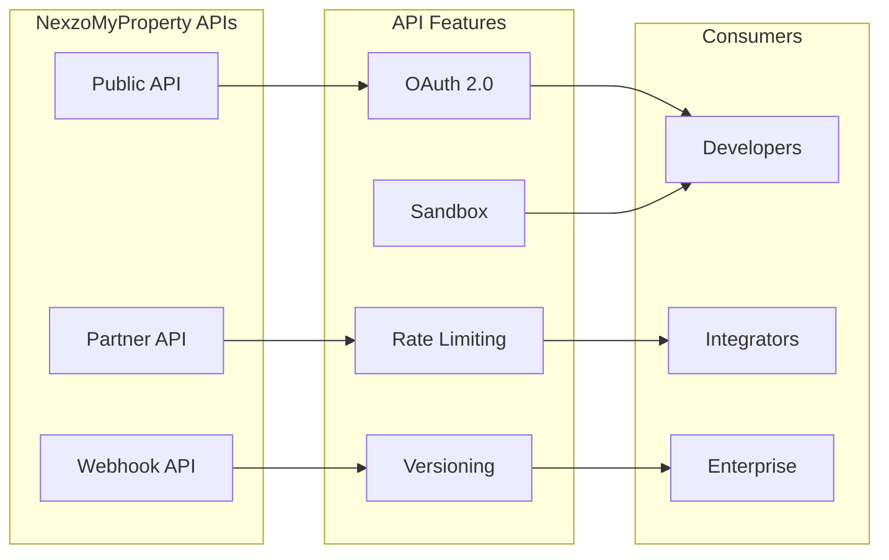

## 15. Marketing & Growth Strategy

### 15.1 Customer Acquisition Channels

1. **Direct Sales**
   - Property management companies
   - Real estate investment trusts (REITs)
   - Solar installers partnership

2. **Digital Marketing**
   - SEO-optimized content marketing
   - Social media presence
   - Webinars and demos

3. **Channel Partners**
   - Property management software vendors
   - Solar equipment distributors
   - Real estate associations

4. **Referral Program**
   - Tenant referrals
   - Landlord network effects
   - Service provider recommendations

### 15.2 Growth Metrics Framework

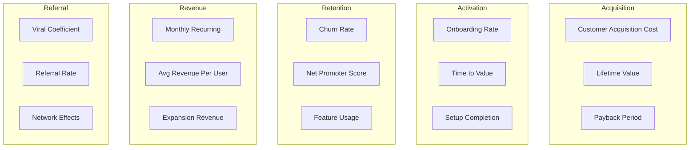

## Conclusion

NexzoMyProperty represents a paradigm shift in property management, transforming it from a reactive, manual process to a proactive, AI-driven ecosystem. By focusing on transparency, automation, and value creation for all stakeholders, the platform is positioned to become the definitive solution for modern property management in the renewable energy era.

The combination of solar integration, AI orchestration, and ecosystem thinking creates a defensible moat while delivering measurable value to landlords, tenants, and service providers alike. With careful execution of the phased roadmap and continuous innovation, NexzoMyProperty can capture significant market share while driving the industry toward a more sustainable, efficient future.

---

*This concept document represents the comprehensive vision for NexzoMyProperty, integrating utility management, AI automation, service orchestration, and sustainable energy practices into a unified platform that serves as the operating system for modern property management.*

**Document Version:** 2.0  
**Date:** September 2025  
**Status:** Comprehensive Concept Document  
**Next Steps:** Technical Architecture Deep Dive, MVP Development Plan, Go-to-Market Strategy